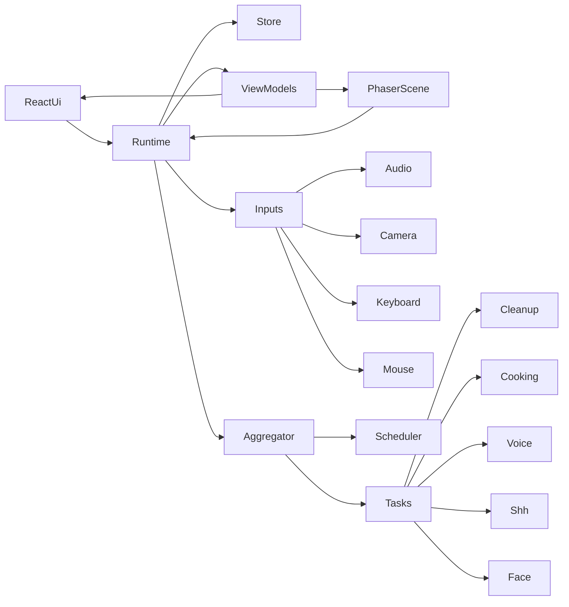
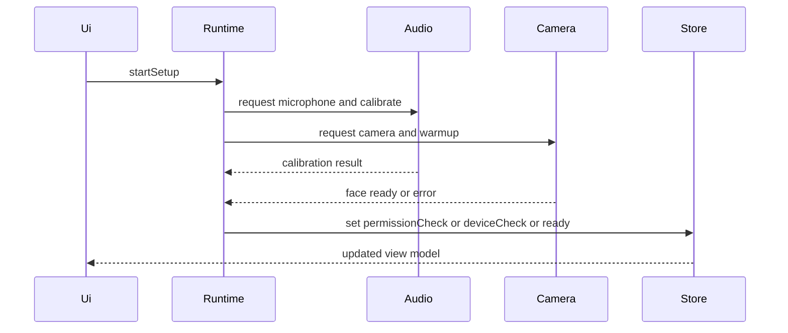
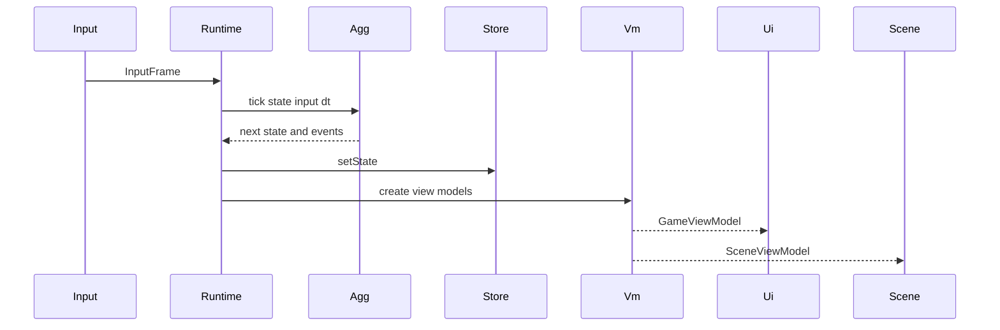

# Design Document

## Overview
本機能は、0歳児育児の忙しさを PC ブラウザで疑似体験できる 5 分間のゲームとして実装するための技術設計である。プレイヤーは、赤ちゃんの機嫌と親の心労を管理しながら、キーボード、マウス、マイク、カメラの 4 系統入力を同時に扱う。

この設計では、ゲームルールを純粋関数中心の Core に閉じ込め、React は権限確認と HUD、Phaser は中央ゲームビュー描画、入力 adapter は生デバイス入力の正規化だけを担当する。これにより、複合入力ゲームでありながら、要求追跡、TDD、タスク分割、将来のライブラリ交換を成立させる。

### Goals
- 4 系統入力を扱うゲーム進行を、1 つの正規状態 `GameState` に集約する
- React と Phaser の責務を分離し、UI と描画が Core を直接変更しない構成にする
- マイクとカメラのブラウザ制約、権限導線、プライバシー要件を実装順序に落とし込む
- unit、integration、E2E へ展開しやすい境界と file structure を定義する

### Non-Goals
- バックエンド、認証、永続保存、ランキングの設計
- スマートフォン UI 最適化やモバイルブラウザ差異への個別対応
- 表情推定、音程判定、歌唱スコアなど MVP 範囲外のセンサー機能
- Phaser Editor や専用アセット制作パイプラインの導入

## Boundary Commitments

### This Spec Owns
- タイトル、権限確認、デバイスチェック、Ready、Playing、Paused、GameOver、Result の phase 制御
- 2 つの主要ゲージ、スコア、警告、破綻判定、タスクスケジュールの正規状態
- 片付け、ベビーフード、呼びかけ連打、しーっ、顔ポジション合わせの task logic
- マイク、カメラ、キーボード、マウス入力を `InputFrame` へ正規化する adapter 契約
- React HUD と Phaser viewport の協調、および 1 プレイ完結の local-only 体験

### Out of Boundary
- アカウント、保存、ランキング、外部 API、広告、課金
- スマホ向け専用レイアウトや touch 操作
- 表情 blendshape 利用、音声認識、音程スコアリング
- 追加ステージ、複数部屋、難易度プリセット、アクセシビリティ完全対応

### Allowed Dependencies
- `react@19.2.x` と `react-dom@19.2.x`
- `vite@8.x` と `@vitejs/plugin-react@6.x`
- `phaser@4.1.x`
- `typescript@6.x`
- `@mediapipe/tasks-vision@0.10.x`
- ブラウザ標準 API: `getUserMedia`, `AnalyserNode`, `requestAnimationFrame`, `Worker`, `ImageBitmap`
- テスト: `vitest@4.x`, `@playwright/test@1.59.x`

### Revalidation Triggers
- `GameState`, `InputFrame`, `GameCommand`, `GameViewModel`, `SceneViewModel` の shape 変更
- camera adapter の Worker 方式撤回または MediaPipe 以外への差し替え
- React / Phaser 間の依存方向変更
- Vite root、Node.js 前提、public asset 配置、secure context 前提の変更
- `.kiro/steering/` 追加により root 構成やテスト方針の全体規約が入る場合

## Architecture

### Existing Architecture Analysis
本リポジトリは greenfield であり、実装コードは未作成である。実質的な既存アーキテクチャは `docs/requirement.md` と `docs/design.md` にある責務分離方針のみである。

制約として、`.kiro/steering/` が未作成のため、全体規約は `AGENTS.md` と spec ファイルが代替の一次情報となる。したがって本設計は、後続実装者が迷わない程度まで file structure と dependency direction を明示する。

### Architecture Pattern & Boundary Map
**Architecture Integration**:
- Selected pattern: functional core + adapter shell
- Domain/feature boundaries: Core が正規状態、Runtime が制御、Adapters が外部入力変換、Presentation が描画と操作導線
- Existing patterns preserved: `docs/design.md` の `GameRuntime -> GameAggregator -> ViewModelFactory` と「UI は command 発行のみ」を維持
- New components rationale: camera worker、view model factory、custom subscribe store を追加して性能要件と UI 分離を両立する
- Steering compliance: steering 不在のため、requirements と discovery の boundary を直接実装境界へ変換する



**Dependency Direction**:
`domain types -> domain reducers and task logic -> runtime services -> adapters -> ui and phaser`

UI と Phaser は `GameRuntime` の公開契約だけを通して Core に触れる。adapter は `GameState` を知らず、Core はブラウザ API を直接呼ばない。

### Technology Stack

| Layer | Choice / Version | Role in Feature | Notes |
|-------|------------------|-----------------|-------|
| Frontend | React 19.2.5 | 画面遷移、HUD、権限説明、リザルト | React 19 系の標準構成 |
| Game Rendering | Phaser 4.1.0 | 中央ゲームビュー描画、手元タスク表現 | 4.1.0 で ESM default export 修正済み |
| Build | Vite 8.0.10 | dev server、build、asset 配布 | Node.js 20.19+ が前提 |
| React Build Plugin | `@vitejs/plugin-react` 6.0.1 | React Refresh と JSX 変換 | Vite 8 系と整合 |
| Language | TypeScript 6.0.3 | 型安全な domain 契約 | `any` 禁止 |
| Camera Inference | `@mediapipe/tasks-vision` 0.10.35 | 顔位置とサイズ検出 | Web guide は同期推論のため Worker 分離を採用 |
| Audio Analysis | Web Audio API `AnalyserNode` | RMS 音量、ピーク、安定性判定 | ブラウザ標準 |
| Device Access | `getUserMedia` | マイクとカメラ取得 | secure context 必須 |
| Unit and Integration Test | Vitest 4.1.5 | task logic、aggregator、adapter contract | TypeScript と相性が良い |
| E2E Test | Playwright 1.59.1 | 権限導線と主要フロー検証 | local browser 前提 |

## File Structure Plan

### Directory Structure
```text
package.json                      # scripts and dependencies
tsconfig.json                     # strict TypeScript configuration
vite.config.ts                    # Vite 8 and React plugin configuration
index.html                        # Vite entry document
public/
├── models/
│   └── face_landmarker.task      # MediaPipe model asset served from same origin
└── vendor/
    └── mediapipe/
        └── wasm/                 # Face Landmarker wasm assets copied at install/build time
src/
├── main.tsx                      # React bootstrap
├── app/
│   ├── App.tsx                   # Root screen shell and phase routing
│   ├── bootstrap/
│   │   └── createGameRuntime.ts  # Dependency wiring and singleton runtime creation
│   └── runtime/
│       ├── GameRuntime.ts        # Tick loop, command dispatch, subscription API
│       ├── InMemoryGameStore.ts  # Single source of truth storage
│       ├── GameViewModelFactory.ts # Domain state to React and Phaser view models
│       ├── ClockPort.ts          # Time abstraction for tests
│       └── RandomPort.ts         # Random abstraction for deterministic scheduling
├── domain/
│   ├── game/
│   │   ├── GameState.ts          # Core state and phase types
│   │   ├── GameCommand.ts        # UI and engine commands
│   │   ├── GameEvent.ts          # Domain event contract
│   │   ├── GameAggregator.ts     # Pure state transitions
│   │   ├── GameScheduler.ts      # Task spawn policy and phase weighting
│   │   ├── GaugeReducer.ts       # Gauge updates and collapse timers
│   │   └── ScoreReducer.ts       # Score and result rank updates
│   ├── input/
│   │   ├── InputFrame.ts         # Normalized input contract
│   │   ├── KeyboardSnapshot.ts   # Keyboard state shape
│   │   ├── MouseSnapshot.ts      # Mouse state shape
│   │   ├── MicrophoneSnapshot.ts # Audio analyzer output shape
│   │   └── CameraSnapshot.ts     # Face detector output shape
│   └── tasks/
│       ├── TaskRegistry.ts       # Task logic dispatch table
│       ├── TaskTypes.ts          # Shared task state and metadata
│       ├── cleanup/
│       │   └── CleanupTaskLogic.ts
│       ├── cooking/
│       │   └── CookingTaskLogic.ts
│       ├── voice/
│       │   ├── VoiceRhythmTaskLogic.ts
│       │   └── ShhTaskLogic.ts
│       └── face/
│           └── FacePositionTaskLogic.ts
├── adapters/
│   ├── input/
│   │   ├── InputFrameCollector.ts # Merges adapter snapshots into one frame
│   │   ├── KeyboardAdapter.ts     # Key state collection
│   │   └── MouseAdapter.ts        # Pointer and gesture collection
│   ├── audio/
│   │   ├── AudioAnalyzerPort.ts   # Audio adapter contract
│   │   ├── WebAudioAnalyzer.ts    # AnalyserNode based implementation
│   │   └── rms.ts                 # Pure RMS utility
│   ├── camera/
│   │   ├── FaceDetectorPort.ts    # Camera adapter contract
│   │   ├── MediaPipeFaceAdapter.ts # Main thread facade with cached snapshots
│   │   ├── faceWorker.ts          # Worker entry running MediaPipe detection
│   │   ├── workerMessages.ts      # Worker message types
│   │   └── normalizeFaceBox.ts    # Raw landmark result to normalized face box
│   └── phaser/
│       ├── PhaserGameHost.ts      # Phaser game lifecycle and mount management
│       ├── MainScene.ts           # Scene that renders SceneViewModel only
│       └── SceneRenderer.ts       # View model to scene objects mapping
├── ui/
│   ├── hooks/
│   │   ├── useGameViewModel.ts    # useSyncExternalStore bridge
│   │   └── useRuntimeCommand.ts   # Stable command dispatch bridge
│   ├── screens/
│   │   ├── TitleScreen.tsx
│   │   ├── PermissionCheckScreen.tsx
│   │   ├── DeviceCheckScreen.tsx
│   │   ├── ReadyScreen.tsx
│   │   ├── PlayingScreen.tsx
│   │   ├── PauseOverlay.tsx
│   │   ├── GameOverScreen.tsx
│   │   └── ResultScreen.tsx
│   └── components/
│       ├── GaugeHud.tsx
│       ├── TaskListPanel.tsx
│       ├── SensorStatusPanel.tsx
│       ├── FocusedTaskPanel.tsx
│       └── DeviceCheckPanel.tsx
└── test/
    ├── unit/                      # Reducer and task logic tests
    ├── integration/               # Runtime and adapter contract tests
    └── e2e/                       # Playwright user flows
```

### Modified Files
- なし。greenfield のため本 spec は上記の新規作成構成を前提にする。

## System Flows



開始前は React 画面が主導する。`Runtime` は device adapter を起動し、マイクのノイズ床、Too Loud 閾値、顔検出可否を確定したあとにのみ `ready` へ遷移する。



`InputFrameCollector` は最新の keyboard、mouse、audio、camera snapshot を 1 フレームへ束ねる。camera は Worker 側で最新結果をキャッシュし、tick は同期的にその snapshot を読むだけにする。

## Requirements Traceability

| Requirement | Summary | Components | Interfaces | Flows |
|-------------|---------|------------|------------|-------|
| 1 | 権限確認と開始条件 | ReactShell, GameRuntime, WebAudioAnalyzer, MediaPipeFaceAdapter | `GameCommand`, `AudioAnalyzerPort`, `FaceDetectorPort` | Setup sequence |
| 2 | 5分セッション進行 | GameRuntime, InMemoryGameStore, GameAggregator, ReactShell | `GameRuntimeService`, `GameState` | Gameplay tick |
| 3 | ゲージと破綻条件 | GameAggregator, GaugeReducer, ScoreReducer, GameViewModelFactory | `GameEvent`, `GameState` | Gameplay tick |
| 4 | タスク発生と複合操作 | GameScheduler, TaskRegistry, GameAggregator, InputFrameCollector | `TaskInstanceState`, `InputFrame` | Gameplay tick |
| 5 | 片付けタスク | CleanupTaskLogic, PhaserSceneBridge, KeyboardAdapter | `KeyboardSnapshot`, `SceneViewModel` | Gameplay tick |
| 6 | ベビーフード作り | CookingTaskLogic, PhaserSceneBridge, MouseAdapter | `MouseSnapshot`, `SceneViewModel` | Gameplay tick |
| 7 | 呼びかけ連打 | VoiceRhythmTaskLogic, WebAudioAnalyzer, SensorStatusPanel | `MicrophoneSnapshot` | Gameplay tick |
| 8 | しーっタスク | ShhTaskLogic, WebAudioAnalyzer, SensorStatusPanel | `MicrophoneSnapshot` | Gameplay tick |
| 9 | 顔ポジション合わせ | FacePositionTaskLogic, MediaPipeFaceAdapter, SensorStatusPanel | `CameraSnapshot` | Gameplay tick |
| 10 | HUD とリザルト | GameViewModelFactory, ReactShell, PhaserSceneBridge | `GameViewModel`, `SceneViewModel` | Setup and gameplay |
| 11 | 利用環境とプライバシー | ReactShell, GameRuntime, WebAudioAnalyzer, MediaPipeFaceAdapter | `GameCommand`, `AudioAnalyzerPort`, `FaceDetectorPort` | Setup sequence |

## Components and Interfaces

| Component | Domain/Layer | Intent | Req Coverage | Key Dependencies | Contracts |
|-----------|--------------|--------|--------------|------------------|-----------|
| GameRuntime | App | tick と command を調停する | 1, 2, 10, 11 | Store P0, Aggregator P0, InputCollector P0 | Service, State |
| GameAggregator | Domain | 正規状態の純粋遷移 | 2, 3, 4, 5, 6, 7, 8, 9 | Scheduler P0, TaskRegistry P0 | Service |
| GameScheduler | Domain | 時間帯とゲージに応じた発生制御 | 4 | RandomPort P1 | Service |
| InputFrameCollector | Adapter | 全入力を 1 フレームへ統合 | 1, 4, 7, 8, 9, 11 | Audio P0, Camera P0, Keyboard P0, Mouse P0 | Service |
| WebAudioAnalyzer | Adapter | マイク権限、キャリブレーション、RMS 解析 | 1, 7, 8, 11 | `getUserMedia` P0, `AnalyserNode` P0 | Service, State |
| MediaPipeFaceAdapter | Adapter | 顔検出結果を normalized snapshot に変換 | 1, 9, 11 | MediaPipe P0, Worker P1 | Service, State |
| GameViewModelFactory | App | Domain state を UI と Scene 用に変換 | 2, 3, 10 | Store P0 | Service |
| PhaserSceneBridge | Presentation | SceneViewModel を描画へ反映 | 4, 5, 6, 10 | Phaser P0, Runtime P0 | Service, State |
| ReactShell | Presentation | 画面相と HUD を表示し command を送る | 1, 2, 10, 11 | Runtime P0, ViewModels P0 | Service |

### App Layer

#### GameRuntime

| Field | Detail |
|-------|--------|
| Intent | phase ごとの進行、tick、command dispatch、購読通知を制御する |
| Requirements | 1, 2, 10, 11 |

**Responsibilities & Constraints**
- `GameState` の現在値を store 経由で読む
- gameplay phase でのみ fixed-tick を許可する
- setup phase では device adapter の起動と結果反映を行う
- adapter から得た snapshot を domain へ渡すが、domain 判定は行わない

**Dependencies**
- Inbound: ReactShell — command 発行と購読開始 (P0)
- Inbound: PhaserSceneBridge — frame tick 開始停止 (P0)
- Outbound: InMemoryGameStore — 状態保管 (P0)
- Outbound: GameAggregator — 正規遷移 (P0)
- Outbound: InputFrameCollector — 入力集約 (P0)
- Outbound: GameViewModelFactory — 描画用変換 (P0)

**Contracts**: Service [x] / API [ ] / Event [ ] / Batch [ ] / State [x]

##### Service Interface
```typescript
type RuntimeListener = () => void;

interface GameRuntimeService {
  dispatch(command: GameCommand): Promise<GameUpdateResult> | GameUpdateResult;
  tick(dtMs: number): GameUpdateResult;
  getState(): GameState;
  getViewModel(): GameViewModel;
  getSceneViewModel(): SceneViewModel;
  subscribe(listener: RuntimeListener): () => void;
}
```
- Preconditions:
  - setup 開始前に `createGameRuntime()` が依存を解決している
  - `tick()` は `playing` または `paused` 系 phase でのみ呼ばれる
- Postconditions:
  - `dispatch()` と `tick()` は必ず最新 state を store へ反映する
  - 購読者は state 更新後に通知される
- Invariants:
  - Runtime 自身は game rule を直接変更しない
  - `GameState` は store に一つだけ存在する

##### State Management
- State model: `GameState` と、device adapter の ephemeral handle を分離して保持する
- Persistence & consistency: persistence なし、1 プレイ中のみメモリ保持
- Concurrency strategy: camera は cached snapshot 読み取り、store 更新は main thread のみ

**Implementation Notes**
- Integration: Phaser と React は同じ Runtime を共有する
- Validation: fake store と fake collector で Runtime 単体テスト可能にする
- Risks: setup phase の async dispatch と gameplay tick の競合を避けるため、phase guard を徹底する

#### GameViewModelFactory

| Field | Detail |
|-------|--------|
| Intent | `GameState` を React 用と Phaser 用の描画契約へ変換する |
| Requirements | 2, 3, 10 |

**Responsibilities & Constraints**
- UI が必要な文脈だけを `GameViewModel` に出す
- Phaser が必要な focused hand task の描画情報だけを `SceneViewModel` に出す
- 内部数値をそのまま出さない要件はここで最終保証する

**Dependencies**
- Inbound: GameRuntime — 最新 state (P0)
- Outbound: ReactShell — HUD と画面 phase (P0)
- Outbound: PhaserSceneBridge — gameplay scene object list (P0)

**Contracts**: Service [x] / API [ ] / Event [ ] / Batch [ ] / State [ ]

##### Service Interface
```typescript
interface GameViewModelFactory {
  createGameViewModel(state: GameState): GameViewModel;
  createSceneViewModel(state: GameState): SceneViewModel;
}
```
- Preconditions:
  - `GameState` が正規化済みである
- Postconditions:
  - UI に不要な domain 内部詳細は view model に露出しない
- Invariants:
  - `GameViewModel` と `SceneViewModel` は読み取り専用 DTO として扱う

**Implementation Notes**
- Integration: ラベル文言や危険表示は React へ、座標系情報は Phaser へ振り分ける
- Validation: snapshot test ではなく、field 単位の expectation を使う
- Risks: view model が肥大化したら task ごとの mapper に分離する

### Domain Layer

#### GameAggregator

| Field | Detail |
|-------|--------|
| Intent | `GameState` と `InputFrame` から次状態と event を返す純粋遷移の中心 |
| Requirements | 2, 3, 4, 5, 6, 7, 8, 9 |

**Responsibilities & Constraints**
- 時間経過、task 更新、ゲージ更新、ゲーム終了判定を一つの tick で解決する
- command 起点の phase 変更も扱う
- ブラウザ API、Phaser object、React state を参照しない

**Dependencies**
- Inbound: GameRuntime — 現在 state と input (P0)
- Outbound: GameScheduler — spawn 候補決定 (P0)
- Outbound: TaskRegistry — task 種別別の更新 (P0)
- Outbound: GaugeReducer — clamp と collapse timers (P0)
- Outbound: ScoreReducer — score と rank 更新 (P0)

**Contracts**: Service [x] / API [ ] / Event [x] / Batch [ ] / State [ ]

##### Service Interface
```typescript
type GameUpdateResult = {
  state: GameState;
  events: GameEvent[];
};

interface GameAggregatorService {
  tick(state: GameState, input: InputFrame, dtMs: number): GameUpdateResult;
  dispatch(state: GameState, command: GameCommand): GameUpdateResult;
}
```
- Preconditions:
  - `state` は不変入力として扱う
  - `input.sampledAtMs` は単調増加する
- Postconditions:
  - 返却 `state` は新しい参照を持つ
  - 重要な遷移は `events` に記録される
- Invariants:
  - gauge 値は許容範囲へ clamp される
  - task 数制限を超える state は生成しない

**Implementation Notes**
- Integration: task logic は registry 経由で差し込み、aggregator 本体は task 個別分岐を増やしすぎない
- Validation: scenario tests の主対象にする
- Risks: command と tick の責務が混ざると肥大化しやすいため reducer 単位へ分割する

#### GameScheduler

| Field | Detail |
|-------|--------|
| Intent | 時間帯、ゲージ、同時数制限に基づく task 発生を決める |
| Requirements | 4 |

**Responsibilities & Constraints**
- 手元最大 2、センサー最大 2、マイク最大 1、カメラ最大 1 を守る
- 後半になるほど複合操作しやすい組み合わせを出す
- 既存継続 task の進捗保持を優先し、再 spawn で上書きしない

**Dependencies**
- Inbound: GameAggregator — state と時刻 (P0)
- Outbound: RandomPort — weighted choice (P1)

**Contracts**: Service [x] / API [ ] / Event [ ] / Batch [ ] / State [ ]

##### Service Interface
```typescript
interface GameSchedulerService {
  planSpawns(state: GameState, random: RandomPort): PlannedSpawn[];
}
```
- Preconditions:
  - `state.phase` が `playing` である
- Postconditions:
  - 返却 spawn は同時数制約を満たす
- Invariants:
  - 進行中の cooking は再 spawn せず継続表示とする

**Implementation Notes**
- Integration: phase 別重みは定数テーブルとして分離する
- Validation: deterministic random を注入して spawn policy をテストする
- Risks: 難易度調整が多変量になるので、閾値は定数モジュールへ切り出す

#### TaskRegistry

| Field | Detail |
|-------|--------|
| Intent | task kind ごとの更新ロジックを束ねて aggregator から疎結合に呼び出す |
| Requirements | 4, 5, 6, 7, 8, 9 |

**Responsibilities & Constraints**
- task state の discriminated union に応じて適切な logic へ委譲する
- task effect を共通形式へ正規化する
- 新 task 追加時の変更範囲を registry と新 logic に限定する

**Dependencies**
- Inbound: GameAggregator — active tasks (P0)
- Outbound: CleanupTaskLogic — 片付け更新 (P0)
- Outbound: CookingTaskLogic — 料理更新 (P0)
- Outbound: VoiceRhythmTaskLogic — 音声連打更新 (P0)
- Outbound: ShhTaskLogic — 維持更新 (P0)
- Outbound: FacePositionTaskLogic — 顔位置更新 (P0)

**Contracts**: Service [x] / API [ ] / Event [ ] / Batch [ ] / State [ ]

##### Service Interface
```typescript
interface TaskRegistryService {
  updateTask(task: TaskInstanceState, input: InputFrame, dtMs: number): TaskUpdateResult;
}
```
- Preconditions:
  - `task.kind` に対応する logic が登録済みである
- Postconditions:
  - result は task next state と gauge or score effects を返す
- Invariants:
  - logic は対象 task 以外の state を直接変更しない

**Implementation Notes**
- Integration: task-specific constants は各 domain 下へ置く
- Validation: registry は dispatch table の mapping test を持つ
- Risks: result 形式が肥大化したら effect category を整理する

### Adapter Layer

#### InputFrameCollector

| Field | Detail |
|-------|--------|
| Intent | デバイスごとの最新 snapshot を 1 つの `InputFrame` へ束ねる |
| Requirements | 1, 4, 7, 8, 9, 11 |

**Responsibilities & Constraints**
- keyboard と mouse はその場の生入力を snapshot 化する
- audio と camera は adapter 内キャッシュの最新値を読む
- gameplay phase 以外でも device check 用の短い polling を許可する

**Dependencies**
- Inbound: GameRuntime — tick timing (P0)
- Outbound: WebAudioAnalyzer — microphone snapshot (P0)
- Outbound: MediaPipeFaceAdapter — camera snapshot (P0)
- Outbound: KeyboardAdapter — keyboard snapshot (P0)
- Outbound: MouseAdapter — mouse snapshot (P0)

**Contracts**: Service [x] / API [ ] / Event [ ] / Batch [ ] / State [ ]

##### Service Interface
```typescript
interface InputFrameCollector {
  collect(sampledAtMs: number): InputFrame;
}
```
- Preconditions:
  - required adapter が初期化済みである
- Postconditions:
  - 返却 `InputFrame` は全入力系統を含む
- Invariants:
  - missing device は `available: false` を返し、undefined を返さない

**Implementation Notes**
- Integration: gameplay tick とは別に device check poll を流せる設計にする
- Validation: fake adapter snapshot で集約テストを書く
- Risks: 入力サンプリング頻度の差で stale な camera result が混ざるので timestamp を保持する

#### WebAudioAnalyzer

| Field | Detail |
|-------|--------|
| Intent | マイク取得、ノイズ床計測、RMS 音量解析、ピーク判定を行う |
| Requirements | 1, 7, 8, 11 |

**Responsibilities & Constraints**
- `getUserMedia({ audio: true })` によるストリーム取得
- `AnalyserNode` による time-domain サンプル取得と RMS 算出
- noise floor、voice threshold、too loud threshold の session 内保持
- タブ離脱やタイトル復帰時に track を停止する

**Dependencies**
- Inbound: InputFrameCollector — latest microphone snapshot 要求 (P0)
- Inbound: GameRuntime — start and stop (P0)
- External: `getUserMedia` — 権限付き音声取得 (P0)
- External: `AnalyserNode` — 音量解析 (P0)

**Contracts**: Service [x] / API [ ] / Event [ ] / Batch [ ] / State [x]

##### Service Interface
```typescript
type InputDeviceError =
  | { kind: 'permissionDenied' }
  | { kind: 'deviceUnavailable' }
  | { kind: 'calibrationFailed' };

type Result<T, E> =
  | { ok: true; value: T }
  | { ok: false; error: E };

interface AudioCalibration {
  noiseFloorRms: number;
  voiceThresholdRms: number;
  tooLoudThresholdRms: number;
}

interface AudioAnalyzerPort {
  start(): Promise<Result<AudioCalibration, InputDeviceError>>;
  stop(): void;
  sample(sampledAtMs: number): MicrophoneSnapshot;
}
```
- Preconditions:
  - secure context で起動されている
- Postconditions:
  - `start()` 成功後は `sample()` が `available: true` を返す
- Invariants:
  - 生波形は永続化しない
  - snapshot には必要最小限の統計値だけを含める

**Implementation Notes**
- Integration: device check 画面は calibration result を人間向け文言へ変換して表示する
- Validation: RMS utility は pure function test、adapter は manual browser 契約テストを持つ
- Risks: マイク環境差で誤判定が起こり得るため再計測ボタンを用意する

#### MediaPipeFaceAdapter

| Field | Detail |
|-------|--------|
| Intent | カメラ映像から正規化顔矩形を得て cached snapshot として提供する |
| Requirements | 1, 9, 11 |

**Responsibilities & Constraints**
- `getUserMedia({ video: true })` によるカメラ取得
- MediaPipe Face Landmarker の初期化
- Worker で `detectForVideo()` を実行し、normalized face box の最新値だけを返す
- 顔未検出、起動失敗、ウォームアップ失敗を明示的な error 種別で返す

**Dependencies**
- Inbound: InputFrameCollector — latest camera snapshot 要求 (P0)
- Inbound: GameRuntime — start and stop (P0)
- External: MediaPipe Face Landmarker — 顔検出 (P0)
- External: Worker — main thread からの分離 (P1)

**Contracts**: Service [x] / API [ ] / Event [ ] / Batch [ ] / State [x]

##### Service Interface
```typescript
type FaceDeviceError =
  | { kind: 'permissionDenied' }
  | { kind: 'deviceUnavailable' }
  | { kind: 'modelLoadFailed' }
  | { kind: 'workerStartupFailed' };

interface FaceCalibration {
  baselineFaceBox: NormalizedFaceBox;
}

interface FaceDetectorPort {
  start(): Promise<Result<FaceCalibration, FaceDeviceError>>;
  stop(): void;
  sample(sampledAtMs: number): CameraSnapshot;
}
```
- Preconditions:
  - model asset と wasm asset が same origin から取得可能である
- Postconditions:
  - `start()` 成功後は最新検出結果を sample で取得できる
- Invariants:
  - raw video frame と landmark 群は永続化しない
  - Core に渡すのは normalized face box と detection metadata のみ

**Implementation Notes**
- Integration: Worker message では `ImageBitmap` を transfer し、主スレッド側は video element と currentTime を管理する
- Validation: adapter contract test は fake worker と real browser の二層に分ける
- Risks: Worker 初期化失敗時は device check で開始不可にする

### Presentation Layer

#### PhaserSceneBridge

| Field | Detail |
|-------|--------|
| Intent | `SceneViewModel` を Phaser Scene に反映し、cleanup と cooking の視覚表現を担う |
| Requirements | 4, 5, 6, 10 |

**Responsibilities & Constraints**
- focused hand task に応じて scene objects を更新する
- keyboard と mouse の低レベルイベントは adapter へ送るだけで state を直接変えない
- GameState を Scene が持たない

**Dependencies**
- Inbound: GameRuntime — scene view model (P0)
- Outbound: KeyboardAdapter — canvas key events (P0)
- Outbound: MouseAdapter — pointer events (P0)
- External: Phaser — scene lifecycle and rendering (P0)

**Contracts**: Service [x] / API [ ] / Event [ ] / Batch [ ] / State [x]

##### Service Interface
```typescript
interface PhaserGameHost {
  mount(container: HTMLDivElement): void;
  unmount(): void;
  render(viewModel: SceneViewModel): void;
}
```
- Preconditions:
  - mount 対象 DOM が存在する
- Postconditions:
  - `render()` は scene object を view model に追従させる
- Invariants:
  - Scene は domain state を内部に保存しない

**Implementation Notes**
- Integration: cleanup と cooking は同一 scene 内で切り替え、HUD は React 側に残す
- Validation: scene rendering は shallow snapshot ではなく、view model to object mapping のテストを持つ
- Risks: Phaser 4 API 変化があった場合は adapter 層だけで吸収する

#### ReactShell

| Field | Detail |
|-------|--------|
| Intent | phase ごとの画面切り替え、HUD、権限説明、リザルト、pause overlay を表示する |
| Requirements | 1, 2, 10, 11 |

**Responsibilities & Constraints**
- `GameViewModel` に応じて screen component を切り替える
- runtime へ送るのは command のみ
- HUD は内部数値そのものではなく view model のラベルを表示する

**Dependencies**
- Inbound: GameRuntime — subscription and dispatch (P0)
- Inbound: GameViewModelFactory — presentable fields (P0)
- Outbound: PhaserSceneBridge — canvas host mount point (P0)

**Contracts**: Service [x] / API [ ] / Event [ ] / Batch [ ] / State [ ]

##### Service Interface
```typescript
interface RuntimeCommandDispatcher {
  send(command: GameCommand): void;
}

interface GameViewModelHook {
  useGameViewModel(): GameViewModel;
}
```
- Preconditions:
  - runtime singleton が bootstrap 済みである
- Postconditions:
  - screen component は phase と view model だけから描画できる
- Invariants:
  - React local state はモーダル開閉や hover など描画補助に限定する

**Implementation Notes**
- Integration: phase ごとに component を分け、task list や sensor status は再利用部品化する
- Validation: permission denied、ready、result の screen 切替は UI integration test で検証する
- Risks: UI convenience のために domain data を重複保持しない

## Data Models

### Domain Model
- Aggregate root: `GameState`
- Child entities: `TaskInstanceState`, `WarningState`, `ScoreState`, `CollapseTimers`
- Value objects: `NormalizedFaceBox`, `AudioCalibration`, `PhaseTimer`, `TaskUrgency`
- Domain events: `taskSpawned`, `taskCompleted`, `taskFailed`, `gaugeChanged`, `warningRaised`, `gameOver`, `gameCleared`, `scoreAdded`
- Business invariants:
  - gauge は常に許容範囲へ clamp
  - playing 中の active task 数は最大 4
  - microphone task は 1、camera task は 1
  - `focusedHandTaskId` は手元 task の active 集合内にある

### Logical Data Model

**Structure Definition**:
```typescript
type GamePhase =
  | 'title'
  | 'permissionCheck'
  | 'deviceCheck'
  | 'ready'
  | 'playing'
  | 'paused'
  | 'gameOver'
  | 'result';

interface GameState {
  phase: GamePhase;
  elapsedMs: number;
  remainingMs: number;
  gauges: {
    babyMood: number;
    parentStress: number;
  };
  score: ScoreState;
  activeTasks: Record<string, TaskInstanceState>;
  focusedHandTaskId: string | null;
  warnings: WarningState[];
  collapseTimers: {
    babyMoodZeroMs: number;
    parentStressMaxMs: number;
    bothDangerMs: number;
  };
  session: {
    microphoneReady: boolean;
    cameraReady: boolean;
    audioCalibration: AudioCalibration | null;
    faceCalibration: FaceCalibration | null;
  };
  result: GameResult | null;
}
```

```typescript
type TaskInstanceState =
  | CleanupTaskState
  | CookingTaskState
  | VoiceRhythmTaskState
  | ShhTaskState
  | FaceAlignTaskState;
```

```typescript
interface InputFrame {
  sampledAtMs: number;
  keyboard: KeyboardSnapshot;
  mouse: MouseSnapshot;
  microphone: MicrophoneSnapshot;
  camera: CameraSnapshot;
}
```

**Consistency & Integrity**:
- transaction boundary は 1 tick ごとの `GameUpdateResult`
- `activeTasks` の生成と削除は scheduler と task completion のみが行う
- `result` は `result` phase でのみ非 null

### Data Contracts & Integration

**API Data Transfer**:
- 外部 HTTP API は存在しない

**Event Schemas**:
- `GameEvent` は UI 演出とテスト検証のための local event
- backward compatibility は不要だが、task 追加時は discriminant を追加するだけで既存 event を壊さない

**Cross-Service Data Management**:
- 該当なし。すべて単一ブラウザタブ内で完結する

## Error Handling

### Error Strategy
権限エラーとデバイス未準備は setup phase で止め、playing 開始を許可しない。playing 中の sensor 消失や判定不能は graceful degradation とし、ゲーム継続は許可しつつタスク効果停止やペナルティへ落とす。

### Error Categories and Responses
- **User Errors**: 権限拒否、マイク無音、顔未検出
  - 応答: 再許可案内、再計測、位置ヒント
- **System Errors**: MediaPipe model load 失敗、Worker 起動失敗、device unavailable
  - 応答: device check 失敗として開始不可、改善案内表示
- **Business Logic Errors**: cooking 焦げ、Too Loud、片付け放置
  - 応答: ペナルティと警告イベント発火

### Monitoring
- 開発時は `GameEvent` を console と test assertion の両方で利用する
- 本 spec では外部監視基盤は持たない
- DeviceCheck 画面には adapter status を人間向け文言へ変換して表示する

## Testing Strategy

### Unit Tests
- `GaugeReducer` が requirement 3 の破綻タイマーと clamp を正しく処理すること
- `VoiceRhythmTaskLogic` が requirement 7 の Perfect、Good、Miss、Too Loud を返すこと
- `ShhTaskLogic` が requirement 8 の成功帯維持、無音失敗、大声ペナルティを返すこと
- `FacePositionTaskLogic` が requirement 9 の位置ヒントと維持成功を返すこと
- `CleanupTaskLogic` と `CookingTaskLogic` が requirement 5 と 6 の部分介入と失敗条件を返すこと

### Integration Tests
- `GameRuntime + GameAggregator` が requirement 2 と 4 の phase 遷移、task 上限制約、combo 報酬を満たすこと
- `InputFrameCollector` が requirement 4、7、8、9 の各 snapshot を 1 フレームへ統合できること
- `WebAudioAnalyzer` が requirement 1、7、8 の calibration と snapshot 契約を満たすこと
- `MediaPipeFaceAdapter` が requirement 1、9、11 の start、sample、stop 契約を満たすこと
- `GameViewModelFactory` が requirement 10 の HUD 表示と内部数値非表示を守ること

### E2E/UI Tests
- 権限拒否時に requirement 1 を満たして開始不可となること
- 権限許可と device check 成功後に ready から playing へ進めること
- requirement 5 と 8 に対応し、しーっ中の料理進行が複合操作として結果へ反映されること
- requirement 6 に対応し、ベビーフードを焦がすと両ゲージへペナルティが入ること
- requirement 10 に対応し、time up 後に result 画面が表示されること

### Performance/Load
- gameplay 中に Phaser render が 30 fps 未満へ落ち続けないこと
- camera detection を 5 から 10 Hz に制限しても requirement 9 の操作感が成立すること
- pause または title 復帰時に audio と video track が停止し、5 分プレイ後もメモリが増え続けないこと

### Security Considerations
- `getUserMedia` の secure context 制約を前提にし、開発は localhost、配布時は HTTPS 前提とする
- 音声と映像は raw データとして保存、送信、永続化しない
- MediaPipe model と wasm asset は same origin で配布し、推論入力を外部サービスへ渡さない
- permission 画面に利用目的と非送信方針を必ず表示する

### Performance & Scalability
- render target は 60 fps 推奨、30 fps を下限とする
- audio sampling は frame ごと、camera inference は 100 から 200 ms 間隔の throttling を採用する
- camera 推論は Worker 側で同期処理し、main thread は cached result のみ参照する
- session は 5 分固定であり、永続データがないため水平スケール要件は存在しない
