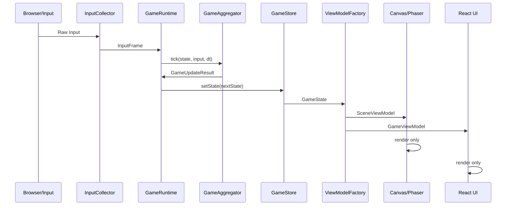
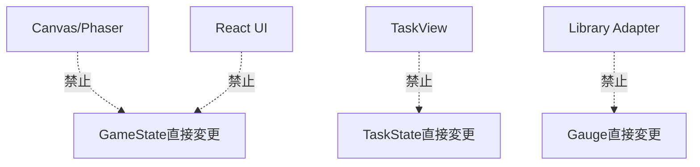
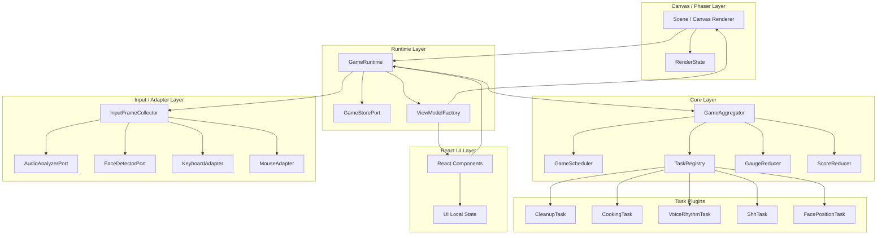

# 技術設計補強版
## 状態管理責務の明確化 + TDD対応設計

---

# 1. 結論

本設計では、Canvas / Phaser などのゲームエンジンと、独自管理のゲーム状態の責務を明確に分離する。

最終方針は以下。

```text
正規のゲーム状態は Core の GameState だけが持つ。

Canvas / Phaser は描画用の一時状態だけを持つ。
UI は ViewModel を表示し、Command を発行するだけ。
入力Adapter は RawInput を InputFrame に変換するだけ。
タスクロジックは InputFrame と State を受け取り、Effect を返すだけ。
```

| 曖昧になりやすい点 | 明確化する方針 |
|---|---|
| Canvas / Phaser がゲーム状態を持ってよいのか | 持たない。表示用キャッシュのみ保持可 |
| キャラクター位置やアイテム位置はどこが持つのか | ゲームルールに関わる位置はCoreが持つ |
| 衝突判定をPhaser Physicsに任せるのか | MVPではCoreで判定する |
| Phaser Scene の `update()` は何をするのか | Runtime / Aggregator の tick を呼ぶだけ |
| React / UI は状態を変更してよいのか | Command発行のみ。直接変更は禁止 |
| テストはどの単位で書くのか | 純粋関数テスト + ユースケースシナリオテストに分離 |
| ランダムや時間をどうテストするのか | Clock / Random を注入して決定論的にする |

---

# 2. 状態管理の責務分離

## 2.1 状態の種類

| 状態種別 | 所有者 | 内容 | 永続性 | テスト対象 |
|---|---|---|---|---|
| Domain State | Core / GameAggregator | ゲームルール上の正規状態 | 必須 | 必須 |
| Render State | Canvas / Phaser Adapter | スプライト、Tween、描画キャッシュ | 一時的 | 原則不要 |
| UI Local State | React UI | ホバー、開閉、入力補助表示 | 一時的 | 必要に応じて |

---

## 2.2 Domain State

Domain State は、ゲームの正規状態である。  
勝敗、ゲージ、タスク進行、位置、料理工程など、ゲーム結果に影響するものはすべてここに置く。

```ts
export type GameState = {
  phase: GamePhase;

  elapsedMs: number;
  remainingMs: number;

  gauges: {
    babyMood: number;
    parentStress: number;
  };

  activeTasks: Record<TaskId, TaskInstanceState>;

  focusedHandTaskId: TaskId | null;

  score: ScoreState;
  warnings: WarningState[];

  collapseTimers?: {
    babyMoodZeroMs: number;
    parentStressMaxMs: number;
    bothDangerMs: number;
  };

  result?: GameResult;
};
```

Domain State に含めるもの。

| 項目 | Domain Stateに含めるか | 理由 |
|---|---:|---|
| 赤ちゃんの機嫌 | 含める | 勝敗に影響 |
| 親の心労 | 含める | 勝敗に影響 |
| 片付けアイテム位置 | 含める | 拾えるかどうかに影響 |
| 親キャラ位置 | 含める | 片付け判定に影響 |
| 料理工程 | 含める | 成功・失敗に影響 |
| 料理温度 | 含める | 焦げ判定に影響 |
| 顔目標枠 | 含める | カメラタスク成功判定に影響 |
| ノーツ配列 | 含める | 音声タスク判定に影響 |
| 残り時間 | 含める | クリア判定に影響 |

---

## 2.3 Render State

Canvas / Phaser が持ってよい状態は、描画都合の状態だけに限定する。

```ts
export type RenderState = {
  spriteByEntityId: Map<string, unknown>;
  activeTweens: Map<string, unknown>;
  loadedAssets: Set<string>;
  cameraViewport: {
    x: number;
    y: number;
    zoom: number;
  };
  lastRenderedFrameAt: number;
};
```

Render State に含めてよいもの。

| 項目 | Render Stateに含めてよいか | 理由 |
|---|---:|---|
| Sprite参照 | 可 | 描画都合 |
| Tween進行 | 可 | 演出都合 |
| Particle | 可 | 演出都合 |
| アニメーション再生状態 | 可 | 表示都合 |
| Asset読み込み状態 | 可 | エンジン都合 |
| カメラ表示位置 | 可 | 表示都合 |
| ゲーム上の親キャラ位置 | 不可 | ゲームルールに影響 |
| アイテムを拾ったか | 不可 | ゲームルールに影響 |
| 料理成功/失敗 | 不可 | ゲームルールに影響 |
| ゲージ値 | 不可 | 勝敗に影響 |

---

## 2.4 UI Local State

React UI が持ってよい状態。

| 項目 | UI Local Stateに含めてよいか |
|---|---:|
| ボタンhover | 可 |
| モーダル開閉アニメーション | 可 |
| ツールチップ表示 | 可 |
| スクロール位置 | 可 |
| 押下中の見た目 | 可 |
| 選択中タスクID | 原則不可 |
| ゲージ値 | 不可 |
| タスク進捗 | 不可 |

重要ルール。

```text
ゲーム結果に影響する状態は UI Local State に置かない。
```

`focusedHandTaskId` は UI の見た目だけでなく、入力の解釈に影響するため Domain State に置く。

---

# 3. Canvas / Phaser と独自状態管理の棲み分け

## 3.1 責務分離表

| 責務 | Core / Aggregator | Canvas / Phaser | React UI |
|---|---:|---:|---:|
| ゲーム時間 | ✅ | ❌ | ❌ |
| タスク発生 | ✅ | ❌ | ❌ |
| ゲージ更新 | ✅ | ❌ | ❌ |
| 勝敗判定 | ✅ | ❌ | ❌ |
| 片付け判定 | ✅ | ❌ | ❌ |
| 料理工程判定 | ✅ | ❌ | ❌ |
| 音声判定結果の解釈 | ✅ | ❌ | ❌ |
| 顔位置判定 | ✅ | ❌ | ❌ |
| スプライト描画 | ❌ | ✅ | △ |
| Canvas描画 | ❌ | ✅ | ❌ |
| HUD表示 | ❌ | ❌ | ✅ |
| タスクカード表示 | ❌ | ❌ | ✅ |
| Command発行 | ❌ | △ | ✅ |

---

## 3.2 Phaser Scene の役割

Phaser を使う場合でも、Scene はゲーム状態を所有しない。

```ts
class MainGameScene extends Phaser.Scene {
  private engineAdapter!: PhaserEngineAdapter;

  create() {
    this.engineAdapter.mount(this);
  }

  update(time: number, delta: number) {
    this.engineAdapter.onEngineTick(delta);
  }
}
```

`onEngineTick` の責務は限定する。

```ts
class PhaserEngineAdapter implements GameEnginePort {
  onEngineTick(dtMs: number) {
    const inputFrame = this.inputCollector.collect();
    this.gameRuntime.tick(inputFrame, dtMs);

    const vm = this.gameRuntime.getViewModel();
    this.renderScene(vm.scene);
  }
}
```

Phaser Scene がしてはいけないこと。

```text
禁止:
- this.babyMood -= 1
- this.task.completed = true
- this.player.x += velocity
- this.item.picked = true
- this.gameOver = true
```

これらはすべて Core が行う。

---

## 3.3 Canvas / Phaser が持ってはいけないもの

```text
Canvas / Phaser は見た目を描く。
ゲームを進めない。
```

| 持ってはいけない状態 | 理由 |
|---|---|
| babyMood | 勝敗に直結 |
| parentStress | 勝敗に直結 |
| activeTasks | タスク制御に直結 |
| cookingStep | 料理成功判定に直結 |
| cleanupItems.stored | 心労変動に直結 |
| voiceNote.judged | 音声タスク判定に直結 |
| faceTargetBox | カメラタスク判定に直結 |
| gamePhase | 画面遷移に直結 |

---

## 3.4 Canvas / Phaser が持ってよいもの

| 持ってよい状態 | 例 |
|---|---|
| スプライト参照 | `playerSprite`, `itemSprites` |
| 表示補間 | 前フレーム位置から現在位置への補間 |
| Tween | 成功時のポップ演出 |
| Particle | キラキラ演出 |
| Asset | 画像・音声読み込み状態 |
| Camera viewport | 描画上のカメラ位置 |
| Layer | 背景、キャラ、UIオーバーレイ |

---

# 4. 更新フロー

## 4.1 正しい更新フロー



---

## 4.2 禁止する逆流



---

# 5. GameRuntime の導入

前回設計では `GameAggregator` が中心だったが、Canvas / Phaser との境界をより明確にするため、外側に `GameRuntime` を置く。

## 5.1 役割

| 要素 | 役割 |
|---|---|
| GameAggregator | 純粋な状態遷移 |
| GameRuntime | 入力収集、tick呼び出し、Store更新、ViewModel生成 |
| GameStore | 現在のGameState保持 |
| EngineAdapter | Runtimeを呼び出して描画する |
| React UI | Store/ViewModelを購読する |

---

## 5.2 GameRuntime

```ts
export class GameRuntime {
  constructor(
    private readonly store: GameStorePort,
    private readonly aggregator: GameAggregator,
    private readonly inputCollector: InputFrameCollector,
    private readonly viewModelFactory: GameViewModelFactory
  ) {}

  tick(dtMs: number): GameUpdateResult {
    const state = this.store.getState();
    const input = this.inputCollector.collect();

    const result = this.aggregator.tick(state, input, dtMs);

    this.store.setState(result.state);

    return result;
  }

  dispatch(command: GameCommand): GameUpdateResult {
    const state = this.store.getState();

    const result = this.aggregator.dispatch(state, command);

    this.store.setState(result.state);

    return result;
  }

  getViewModel(): GameViewModel {
    return this.viewModelFactory.create(this.store.getState());
  }
}
```

---

## 5.3 GameAggregator は純粋関数に近づける

TDDしやすくするため、`GameAggregator` は副作用を持たない設計にする。

```ts
export type GameUpdateResult = {
  state: GameState;
  events: GameEvent[];
};

export class GameAggregator {
  tick(
    state: GameState,
    input: InputFrame,
    dtMs: number
  ): GameUpdateResult {
    return {
      state: nextState,
      events,
    };
  }

  dispatch(
    state: GameState,
    command: GameCommand
  ): GameUpdateResult {
    return {
      state: nextState,
      events,
    };
  }
}
```

これにより、テストでは以下が可能になる。

```text
Given: あるGameState
When: あるInputFrameでtick
Then: 次のGameStateとGameEventを検証
```

---

# 6. GameEvent の導入

TDDでは、状態だけでなく「何が起きたか」を検証したい。  
そのため、`GameEvent` を導入する。

```ts
export type GameEvent =
  | {
      type: "taskSpawned";
      taskId: string;
      taskKind: string;
    }
  | {
      type: "taskCompleted";
      taskId: string;
      taskKind: string;
    }
  | {
      type: "taskFailed";
      taskId: string;
      taskKind: string;
      reason: string;
    }
  | {
      type: "gaugeChanged";
      target: "babyMood" | "parentStress";
      before: number;
      after: number;
      reason: string;
    }
  | {
      type: "warningRaised";
      level: "low" | "medium" | "high";
      message: string;
    }
  | {
      type: "gameOver";
      reason: "babyMoodCollapsed" | "parentStressCollapsed" | "bothDanger";
    }
  | {
      type: "gameCleared";
      result: GameResult;
    }
  | {
      type: "scoreAdded";
      amount: number;
      reason: string;
    };
```

## 6.1 Eventを使う理由

| 理由 | 内容 |
|---|---|
| テストしやすい | 状態差分だけでなく発生事象を検証できる |
| UI演出に使える | 成功演出、警告、SEのトリガーになる |
| デバッグしやすい | 何が起きたか追跡できる |
| ロジックと演出を分離できる | CoreはEventを返し、UI/Engineが演出する |

---

# 7. TDD向け設計方針

## 7.1 テスト可能性の原則

```text
1. ロジックは副作用を持たない
2. 時間は引数で渡す
3. ランダムは注入する
4. 入力はInputFrameとして固定する
5. ライブラリはPort越しに使う
6. UIとEngineはテスト対象の中心にしない
7. Given / When / Then でユースケースを記述できる
```

---

## 7.2 テストピラミッド

```text
        E2E少数
     ───────────
      UseCase Test
   ─────────────────
    Aggregator Test
  ───────────────────
   Task / Reducer Unit
```

| テスト種別 | 対象 | 数 | 目的 |
|---|---|---:|---|
| Unit Test | TaskLogic, GaugeReducer, 判定関数 | 多 | 処理ロジックの正しさ |
| Aggregator Test | tick, dispatch, scheduler | 中 | 状態遷移の正しさ |
| UseCase Test | プレイ状況のシナリオ | 中 | 要件を満たすか |
| Adapter Contract Test | Audio/Camera Adapter | 少 | Port仕様を満たすか |
| UI Test | ViewModel表示 | 少 | 表示変換の正しさ |
| E2E | 実ブラウザ | 最小 | 統合確認 |

---

# 8. 処理ロジック単体テスト設計

## 8.1 テスト対象一覧

| ロジック | テスト内容 |
|---|---|
| `GaugeReducer` | ゲージ増減、clamp、危険域判定 |
| `VoiceRhythmTaskLogic` | Perfect / Good / Miss / Too Loud |
| `ShhTaskLogic` | 音量帯維持、無音、大声 |
| `FacePositionTaskLogic` | 顔位置・サイズ判定、ヒント生成 |
| `CleanupTaskLogic` | 移動、拾う、収納、心労低下 |
| `CookingTaskLogic` | 工程進行、加熱、焦げ、完成 |
| `GameScheduler` | タスク発生制約、重み |
| `ScoreReducer` | 加点、コンボ、減点 |

---

## 8.2 VoiceRhythm 単体テスト例

```ts
describe("VoiceRhythmTaskLogic", () => {
  test("ノーツ中心±100ms以内の音声ピークはPerfect", () => {
    const result = judgeVoiceNote({
      noteTimeMs: 1000,
      inputTimeMs: 1080,
      isTooLoud: false,
    });

    expect(result).toBe("perfect");
  });

  test("大声入力はタイミングが合っていてもTooLoud", () => {
    const result = judgeVoiceNote({
      noteTimeMs: 1000,
      inputTimeMs: 1000,
      isTooLoud: true,
    });

    expect(result).toBe("tooLoud");
  });
});
```

---

## 8.3 FacePosition 単体テスト例

```ts
describe("FacePositionTaskLogic", () => {
  test("顔中心とサイズが目標枠内なら成功", () => {
    const face = {
      x: 0.4,
      y: 0.4,
      width: 0.2,
      height: 0.2,
    };

    const target = {
      x: 0.39,
      y: 0.39,
      width: 0.2,
      height: 0.2,
    };

    expect(
      isFaceAligned(face, target, 0.3, 0.25)
    ).toBe(true);
  });

  test("顔が小さすぎる場合は近づいてヒントを返す", () => {
    const hint = getFaceHint(
      {
        x: 0.4,
        y: 0.4,
        width: 0.1,
        height: 0.1,
      },
      {
        x: 0.4,
        y: 0.4,
        width: 0.2,
        height: 0.2,
      }
    );

    expect(hint).toContain("近づいて");
  });
});
```

---

## 8.4 Cooking 単体テスト例

```ts
describe("CookingTaskLogic", () => {
  test("加熱中はtemperatureが上昇する", () => {
    const state = createCookingState({
      step: "heat",
      temperature: 40,
      isHeating: true,
    });

    const result = updateCookingTask(state, {
      dtMs: 1000,
      input: emptyInputFrame(),
    });

    expect(result.nextState.temperature).toBeGreaterThan(40);
  });

  test("焦げ状態になると機嫌低下と心労増加Effectを返す", () => {
    const state = createCookingState({
      step: "heat",
      temperature: 100,
      isHeating: true,
    });

    const result = updateCookingTask(state, {
      dtMs: 1000,
      input: emptyInputFrame(),
    });

    expect(result.effects).toContainEqual(
      expect.objectContaining({
        type: "adjustGauge",
        target: "babyMood",
        amount: expect.any(Number),
      })
    );

    expect(result.effects).toContainEqual(
      expect.objectContaining({
        type: "adjustGauge",
        target: "parentStress",
        amount: expect.any(Number),
      })
    );
  });
});
```

---

# 9. ユースケーステスト設計

## 9.1 ユースケーステストとは

単体ロジックではなく、実際のプレイ状況を Given / When / Then で検証するテスト。

```text
Given:
  赤ちゃんの機嫌が低い
  呼びかけ連打タスクが発生している

When:
  ノーツに合わせて音声ピークが入力される

Then:
  赤ちゃんの機嫌が回復する
  taskCompletedイベントが発生する
```

---

## 9.2 Scenario Test Harness

```ts
export class GameScenario {
  private state: GameState;
  private events: GameEvent[] = [];

  constructor(
    private readonly aggregator: GameAggregator
  ) {
    this.state = createInitialGameStateForTest();
  }

  givenState(partial: DeepPartial<GameState>): this {
    this.state = mergeGameState(this.state, partial);
    return this;
  }

  givenTask(task: TaskInstanceState): this {
    this.state = addTask(this.state, task);
    return this;
  }

  whenTick(input: InputFrame, dtMs: number): this {
    const result = this.aggregator.tick(this.state, input, dtMs);
    this.state = result.state;
    this.events.push(...result.events);
    return this;
  }

  whenCommand(command: GameCommand): this {
    const result = this.aggregator.dispatch(this.state, command);
    this.state = result.state;
    this.events.push(...result.events);
    return this;
  }

  expectState(assertion: (state: GameState) => void): this {
    assertion(this.state);
    return this;
  }

  expectEvent(assertion: (events: GameEvent[]) => void): this {
    assertion(this.events);
    return this;
  }
}
```

---

## 9.3 ユースケーステスト例：呼びかけ連打で機嫌回復

```ts
test("呼びかけ連打を成功すると赤ちゃんの機嫌が回復する", () => {
  new GameScenario(aggregator)
    .givenState({
      phase: "playing",
      gauges: {
        babyMood: 40,
        parentStress: 30,
      },
    })
    .givenTask(createVoiceRhythmTask({
      id: "voice-1",
      notes: [
        { id: "n1", targetTimeMs: 1000, judged: false },
      ],
      startedAtMs: 0,
    }))
    .whenTick(
      inputFrame({
        microphone: {
          hasPeak: true,
          isTooLoud: false,
          timestampMs: 1000,
        },
      }),
      16
    )
    .expectState((state) => {
      expect(state.gauges.babyMood).toBeGreaterThan(40);
    })
    .expectEvent((events) => {
      expect(events).toContainEqual(
        expect.objectContaining({
          type: "gaugeChanged",
          target: "babyMood",
        })
      );
    });
});
```

---

## 9.4 ユースケーステスト例：しーっしながら料理

```ts
test("しーっ維持中に料理を進めると複合操作として評価される", () => {
  new GameScenario(aggregator)
    .givenState({
      phase: "playing",
      focusedHandTaskId: "cook-1",
      gauges: {
        babyMood: 55,
        parentStress: 50,
      },
    })
    .givenTask(createShhTask({ id: "shh-1" }))
    .givenTask(createCookingTask({
      id: "cook-1",
      step: "mash",
      stepProgress: 30,
    }))
    .whenTick(
      inputFrame({
        microphone: {
          volumeBand: "good",
          stableVoiceMs: 1000,
          isTooLoud: false,
        },
        mouse: {
          circularMotionScore: 0.8,
        },
      }),
      1000
    )
    .expectState((state) => {
      const cooking = state.activeTasks["cook-1"];
      expect(cooking.progress).toBeGreaterThan(30);
    })
    .expectEvent((events) => {
      expect(events).toContainEqual(
        expect.objectContaining({
          type: "scoreAdded",
          reason: "shhCookingCombo",
        })
      );
    });
});
```

---

## 9.5 ユースケーステスト例：顔ポジション成功

```ts
test("顔が目標枠に一定時間合うと赤ちゃんの機嫌が回復する", () => {
  const target = {
    x: 0.4,
    y: 0.4,
    width: 0.2,
    height: 0.2,
  };

  new GameScenario(aggregator)
    .givenState({
      phase: "playing",
      gauges: {
        babyMood: 50,
        parentStress: 30,
      },
    })
    .givenTask(createFacePositionTask({
      id: "face-1",
      targetBox: target,
      requiredHoldMs: 1200,
      accumulatedHoldMs: 0,
    }))
    .whenTick(
      inputFrame({
        camera: {
          faceDetected: true,
          normalizedFaceBox: target,
        },
      }),
      1200
    )
    .expectState((state) => {
      expect(state.gauges.babyMood).toBeGreaterThan(50);
    })
    .expectEvent((events) => {
      expect(events).toContainEqual(
        expect.objectContaining({
          type: "taskCompleted",
          taskId: "face-1",
        })
      );
    });
});
```

---

## 9.6 ユースケーステスト例：ゲームオーバー

```ts
test("赤ちゃんの機嫌0が6秒継続するとゲームオーバーになる", () => {
  new GameScenario(aggregator)
    .givenState({
      phase: "playing",
      gauges: {
        babyMood: 0,
        parentStress: 40,
      },
      collapseTimers: {
        babyMoodZeroMs: 0,
        parentStressMaxMs: 0,
        bothDangerMs: 0,
      },
    })
    .whenTick(emptyInputFrame(), 6000)
    .expectState((state) => {
      expect(state.phase).toBe("gameOver");
    })
    .expectEvent((events) => {
      expect(events).toContainEqual(
        expect.objectContaining({
          type: "gameOver",
          reason: "babyMoodCollapsed",
        })
      );
    });
});
```

---

# 10. ユースケーステスト項目一覧

## 10.1 ゲーム開始・終了

| ID | シナリオ |
|---|---|
| UC-001 | startGame Commandでphaseがplayingになる |
| UC-002 | 5分経過でresultになる |
| UC-003 | 赤ちゃんの機嫌0継続でgameOver |
| UC-004 | 親の心労100継続でgameOver |
| UC-005 | 両ゲージ危険状態継続でgameOver |

---

## 10.2 音声タスク

| ID | シナリオ |
|---|---|
| UC-VO-001 | 呼びかけ連打Perfectで機嫌回復 |
| UC-VO-002 | 呼びかけ連打Goodで機嫌小回復 |
| UC-VO-003 | Too Loudで機嫌低下・心労増加 |
| UC-VO-004 | しーっ成功帯維持で機嫌低下抑制 |
| UC-VO-005 | しーっ大声でペナルティ |
| UC-VO-006 | しーっ中に料理進行で複合操作ボーナス |

---

## 10.3 カメラタスク

| ID | シナリオ |
|---|---|
| UC-CA-001 | 顔が目標枠に合うと維持時間が加算 |
| UC-CA-002 | 顔がずれるとヒントが出る |
| UC-CA-003 | 顔未検出で効果停止 |
| UC-CA-004 | 顔ポジション成功で機嫌回復 |
| UC-CA-005 | 顔ポジション中に片付け成功で複合ボーナス |

---

## 10.4 手元タスク

| ID | シナリオ |
|---|---|
| UC-CL-001 | アイテムを拾える |
| UC-CL-002 | 正しい収納場所で収納できる |
| UC-CL-003 | 収納成功で心労が下がる |
| UC-CL-004 | 片付け放置で心労が上がる |
| UC-CO-001 | 食材クリックで工程進行 |
| UC-CO-002 | 円運動で擦り潰し進行 |
| UC-CO-003 | 適温で加熱停止すると成功 |
| UC-CO-004 | 焦げると機嫌低下・心労増加 |
| UC-CO-005 | 完成で両ゲージ改善 |

---

# 11. Adapter Contract Test

## 11.1 なぜ必要か

Web Audio API や face-api.js は外部依存であり、Coreのユースケーステストに直接使わない。  
ただし、Adapterが Port の仕様を満たしているかは確認する。

---

## 11.2 AudioAnalyzerPort Contract

```ts
describeAudioAnalyzerContract(() => new WebAudioRmsAnalyzer());
```

確認すること。

| 項目 | 内容 |
|---|---|
| startできる | マイク取得開始 |
| stopできる | リソース解放 |
| calibrateできる | noiseFloor取得 |
| analyzeFrameできる | rmsなどを返す |
| 無音時 | hasVoice=false |
| 大音量時 | isTooLoud=true |

MVPでは実マイクを使う自動テストは不安定になりやすい。  
そのため、以下を分離する。

| テスト | 内容 |
|---|---|
| Unit | 波形配列を使ってRMS算出をテスト |
| Manual / Integration | 実ブラウザでマイク許可確認 |

---

## 11.3 FaceDetectorPort Contract

```ts
describeFaceDetectorContract(() => new FaceApiTinyFaceDetectorAdapter());
```

確認すること。

| 項目 | 内容 |
|---|---|
| loadできる | モデル読み込み |
| startできる | カメラ開始 |
| stopできる | カメラ停止 |
| detectFrameできる | FaceDetectionResultを返す |
| 未検出時 | detected=false |
| 検出時 | normalizedFaceBoxが0〜1 |

実カメラテストは不安定なため、Coreテストでは `MockFaceDetector` を使う。

---

# 12. TDDでの開発順序

## 12.1 Red-Green-Refactor の単位

1テストにつき、1つのゲームルールを実装する。

```text
Red:
  まず失敗するテストを書く

Green:
  最小実装で通す

Refactor:
  設計を整える
```

---

## 12.2 実装順

| 順 | 先に書くテスト | 実装 |
|---:|---|---|
| 1 | GaugeReducerの増減テスト | GaugeReducer |
| 2 | GameOver判定テスト | Aggregator破綻判定 |
| 3 | VoiceRhythm判定テスト | VoiceRhythmTask |
| 4 | Shh維持テスト | ShhTask |
| 5 | FaceAlign判定テスト | FacePositionTask |
| 6 | Cleanup収納テスト | CleanupTask |
| 7 | Cooking工程テスト | CookingTask |
| 8 | 複合操作ユースケーステスト | Score / Combo |
| 9 | 5分クリアユースケーステスト | Result |
| 10 | Adapter Contract Test | WebAudio / face-api adapter |

---

# 13. 設計ルール

## 13.1 状態管理ルール

```text
R-SM-001:
  GameStateはCoreが所有する唯一の正規状態である。

R-SM-002:
  Canvas / Phaser はゲームルールに関わる状態を所有してはならない。

R-SM-003:
  Canvas / Phaser はGameViewModelまたはSceneViewModelを受け取って描画する。

R-SM-004:
  React UI はGameStateを直接変更してはならない。

R-SM-005:
  UIとEngineはGameCommandまたはInputFrameを通じてのみCoreへ入力を渡す。

R-SM-006:
  キャラクター位置、アイテム状態、料理工程、タスク進捗はDomain Stateで管理する。

R-SM-007:
  スプライト、Tween、Particle、Asset参照はRender StateとしてEngine Adapterが管理してよい。

R-SM-008:
  Aggregator.tickは副作用を持たず、GameUpdateResultを返す。
```

---

## 13.2 TDDルール

```text
R-TD-001:
  タスクロジックはUIやEngineなしで単体テストできること。

R-TD-002:
  AggregatorはInputFrameとdtMsを与えるだけでユースケーステストできること。

R-TD-003:
  時間はDate.nowではなくdtMsまたはClockPortから渡すこと。

R-TD-004:
  ランダムはMath.randomではなくRandomPortから渡すこと。

R-TD-005:
  外部ライブラリを使う処理はAdapter Contract Testで検証すること。

R-TD-006:
  UseCase TestはGiven / When / Then形式で記述できること。

R-TD-007:
  GameUpdateResult.eventsにより、タスク成功・失敗・ゲージ変動・ゲーム終了を検証できること。
```

---

# 14. 修正後の最終構成



---

# 15. 最終結論

Canvas / Phaser と独自状態管理の責務は、以下で明確に分離する。

```text
Core:
  ゲームの真実を持つ。
  ルールを判定する。
  状態を更新する。
  イベントを返す。

Canvas / Phaser:
  ViewModelを描画する。
  スプライトやTweenを管理する。
  ゲーム状態は持たない。

React UI:
  ViewModelを表示する。
  Commandを発行する。
  ゲーム状態は直接変更しない。

Adapter:
  外部入力・外部ライブラリをCore用データに変換する。
  ゲーム判断はしない。
```

TDDについては、以下で実現する。

```text
処理ロジック:
  TaskLogic / GaugeReducer / Scheduler を純粋関数として単体テストする。

ユースケース:
  GameScenario Harness を使い、
  Given / When / Then で Aggregator の状態遷移を検証する。

外部依存:
  AudioAnalyzerPort / FaceDetectorPort をAdapter Contract Testで検証する。
```

この補強により、次の実装方針が明確になる。

| 実装対象 | 方針 |
|---|---|
| ゲーム状態 | Core GameStateに一元化 |
| Canvas / Phaser | 描画Adapterとして扱う |
| React UI | ViewModel表示とCommand発行のみ |
| タスク追加 | Plugin追加で対応 |
| ライブラリ交換 | Port / Adapter差し替えで対応 |
| TDD | Unit Test + UseCase Test + Contract Testで構成 |

この粒度であれば、次は **型定義の詳細化** または **実装チケット分解** に進める。
