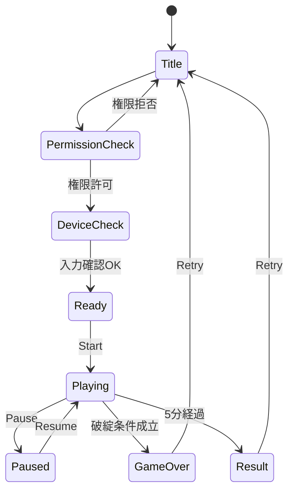
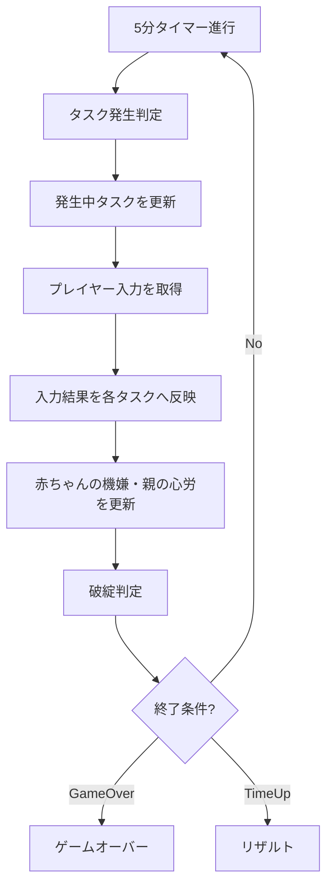
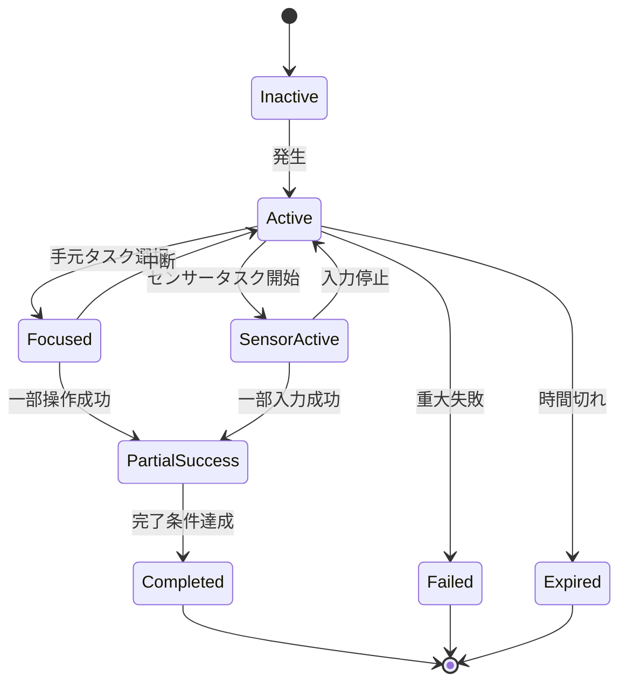
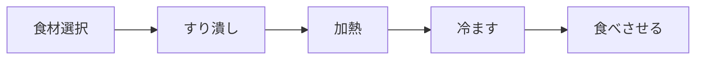

# 設計移行可能版 要件定義書  
## 複数インターフェース型・育児マルチタスクゲーム

---

## 0. 定義漏れ確認結果

前回までの要件は、**ゲームコンセプト・主要タスク・入力方針は十分に固まっている**。  
ただし、そのまま画面設計・状態設計・実装チケットへ落とすには、以下が不足していた。

| 観点 | 前回まで | 補完方針 |
|---|---|---|
| ゲーム状態 | クリア・失敗条件はあるが状態遷移が粗い | タイトル、権限確認、プレイ中、リザルトまで定義 |
| タスク状態 | タスク内容はあるがライフサイクルが不足 | 発生、進行、部分成功、完了、失敗、消滅を定義 |
| 同時操作 | 複数入力の方針はあるが処理ルールが不足 | 手元タスクとセンサータスクを分離 |
| 音声判定 | 案はあるが閾値・判定タイミングが不足 | 音量ピーク、維持時間、Too Loud判定を定義 |
| カメラ判定 | 顔位置案はあるが判定式が不足 | 顔矩形と目標枠の中心・サイズ比較を定義 |
| タスク発生 | 時間帯ごとの傾向はあるが制御が不足 | 最大同時数、スロット、発生重みを定義 |
| UI | 画面イメージはあるが表示ルールが不足 | 常時表示、タスクカード、センサーオーバーレイを定義 |
| 失敗処理 | ペナルティはあるが猶予が不足 | 即死ではなく危険状態の継続で失敗 |
| 技術範囲 | ブラウザ完結は明示済み | バックエンドなし、保存なし、チュートリアルなしを再定義 |
| 初期MVP | Mustはあるがタスク粒度にばらつき | 各タスクを実装単位まで分解 |

以下、これらを補完した再定義版とする。

---

# 1. ゲーム概要

## 1.1 一文定義

本ゲームは、0歳児を育てる親の忙しさを、**キーボード・マウス・マイク・カメラの4入力を並行して使い分ける操作体験**として表現する、ブラウザ完結型カジュアルゲームである。

プレイヤーは5分間、複数の育児・家事タスクに短時間ずつ介入しながら、以下2つの状態を破綻させないようにする。

| 表示ゲージ | 内容 | 悪化すると |
|---|---|---|
| 赤ちゃんの機嫌 | 赤ちゃんが落ち着いているか | 大泣きに近づく |
| 親の心労 | 親の余裕・疲労・混乱度 | 限界に近づく |

---

## 1.2 本ゲームの独自性

```text
見るゲージは2つだけ。
しかし、使う身体入力は4つある。

手：キーボード・マウス
声：マイク
顔：カメラ
目：ゲージとタスク監視
```

このため、ゲームの面白さは以下にある。

| 面白さ | 内容 |
|---|---|
| 入力の忙しさ | 声・顔・手元を同時に使う |
| 判断の忙しさ | どのタスクへ何秒介入するか選ぶ |
| 姿勢の忙しさ | 顔を動かしながら手元操作する |
| 声の忙しさ | 声を短く出す、または長く維持する |
| 維持の忙しさ | 完了ではなく破綻回避を続ける |

---

# 2. 対象範囲

## 2.1 MVPで実装するもの

| 分類 | 要件 |
|---|---|
| 実行環境 | ブラウザ上で完結 |
| プレイ時間 | 1プレイ5分 |
| 管理ゲージ | 赤ちゃんの機嫌、親の心労 |
| 入力 | キーボード、マウス、マイク、カメラ |
| 音声タスク | 呼びかけ連打、しーっタスク |
| カメラタスク | 顔ポジション合わせ |
| キーボードタスク | 部屋の片付け |
| マウスタスク | ベビーフード作り |
| 同時進行 | 複数タスクが同時発生 |
| 部分介入 | 完了前でも途中離脱可能 |
| リザルト | プレイ結果を画面表示 |

---

## 2.2 MVPで実装しないもの

| 項目 | 理由 |
|---|---|
| バックエンド | ブラウザ完結を優先 |
| クラウド保存 | 不要 |
| ユーザー認証 | 不要 |
| オンラインランキング | サーバーが必要 |
| チュートリアル専用画面 | 現段階では不要 |
| 音程判定 | 初期プロダクトでは技術難易度が高い |
| 歌唱スコア | 初期プロダクトでは不要 |
| 表情判定 | 初期プロダクトでは不要 |
| faceExpressionNet利用 | 将来拡張用 |
| スマホ対応 | 初期はPC前提 |

---

# 3. ゲーム状態遷移

## 3.1 状態一覧

| 状態 | 内容 |
|---|---|
| Title | タイトル画面 |
| PermissionCheck | カメラ・マイク権限確認 |
| DeviceCheck | マイク音量・顔検出の簡易確認 |
| Ready | 開始待機 |
| Playing | ゲーム進行中 |
| Paused | 一時停止 |
| GameOver | 破綻による終了 |
| Result | 5分経過後の結果表示 |

---

## 3.2 状態遷移



---

## 3.3 権限拒否時

MVPでは、カメラ・マイクをゲーム体験の必須要素とする。

| 状態 | 挙動 |
|---|---|
| カメラ拒否 | 標準プレイ開始不可 |
| マイク拒否 | 標準プレイ開始不可 |
| 両方拒否 | 標準プレイ開始不可 |
| 表示 | 利用目的と再許可手順を表示 |
| 簡易モード | MVPでは対象外 |

---

# 4. ゲーム進行

## 4.1 基本ループ



---

## 4.2 時間構成

| 実時間 | フェーズ | 目的 |
|---|---|---|
| 0:00〜1:00 | 導入 | キーボード・マウス中心 |
| 1:00〜2:00 | 声の導入 | 呼びかけ連打が発生 |
| 2:00〜3:00 | 継続声・顔の導入 | しーっ、顔ポジションが発生 |
| 3:00〜4:00 | 並行処理 | 手元操作と音声・顔操作が重なる |
| 4:00〜5:00 | 終盤負荷 | 3〜4タスク同時発生、取捨選択が必要 |

チュートリアル画面は実装しない。  
ただし、序盤のタスク発生順で自然に操作負荷を上げる。

---

# 5. 表示ゲージ仕様

## 5.1 赤ちゃんの機嫌

| 項目 | 内容 |
|---|---|
| 内部値 | 0〜100 |
| 初期値 | 70 |
| 良い状態 | 100に近い |
| 悪い状態 | 0に近い |
| 危険域 | 25以下 |
| 破綻域 | 0 |
| ゲームオーバー条件 | 0が6秒継続 |

### 表示

| 内部値 | 表示 | 状態 |
|---:|---|---|
| 76〜100 | 😊 | ごきげん |
| 51〜75 | 🙂 | ふつう |
| 26〜50 | 😟 | ぐずり |
| 1〜25 | 😭 | 大泣き寸前 |
| 0 | 💥😭 | 大泣き |

### 基本変動

| 要因 | 変動 |
|---|---:|
| 通常時間経過 | -0.2 / 秒 |
| 育児タスク放置 | -0.5〜-1.2 / 秒 |
| 呼びかけ連打成功 | +3〜+24 |
| しーっ成功 | +8〜+15 |
| 顔ポジション成功 | +10〜+20 |
| ベビーフード完成 | +15〜+25 |
| 料理失敗 | -10〜-20 |
| 親の心労が80以上 | 低下速度 +30% |

---

## 5.2 親の心労

| 項目 | 内容 |
|---|---|
| 内部値 | 0〜100 |
| 初期値 | 25 |
| 良い状態 | 0に近い |
| 悪い状態 | 100に近い |
| 危険域 | 75以上 |
| 破綻域 | 100 |
| ゲームオーバー条件 | 100が6秒継続 |

### 表示

| 内部値 | 表示 | 状態 |
|---:|---|---|
| 0〜30 | 🟢 | 余裕あり |
| 31〜60 | 🟡 | しんどい |
| 61〜80 | 🟠 | 限界近い |
| 81〜99 | 🔴 | もう無理 |
| 100 | 💥 | 限界 |

### 基本変動

| 要因 | 変動 |
|---|---:|
| 通常時間経過 | +0.1 / 秒 |
| 発生タスク数が3以上 | +0.3 / 秒 |
| 発生タスク数が4 | +0.6 / 秒 |
| 片付け成功 | -4〜-12 |
| ベビーフード工程進行 | -1〜-3 |
| ベビーフード完成 | -8〜-12 |
| 料理失敗 | +10〜+20 |
| 音声Too Loud | +2〜+5 |
| 顔未検出が続く | +2〜+5 |
| 赤ちゃん機嫌が25以下 | +0.8 / 秒 |

---

## 5.3 両ゲージ同時危険

| 条件 | 内容 |
|---|---|
| 赤ちゃんの機嫌25以下 |
| 親の心労75以上 |
| 上記が10秒継続 |

両方が危険域に入った状態が10秒継続した場合、ゲームオーバーとする。  
単独ゲージ破綻よりも早く警告演出を出す。

---

# 6. 入力設計

## 6.1 入力分類

| 入力 | 用途 | 必須 |
|---|---|---|
| キーボード | 片付け、移動、タスク選択 | 必須 |
| マウス | 料理、クリック、ドラッグ | 必須 |
| マイク | 呼びかけ連打、しーっ | 必須 |
| カメラ | 顔ポジション合わせ | 必須 |

---

## 6.2 手元タスクとセンサータスク

本ゲームでは、同時操作を成立させるため、タスクを2系統に分ける。

| 系統 | 対象 | 特徴 |
|---|---|---|
| 手元タスク | キーボード、マウス | メイン画面で操作する |
| センサータスク | マイク、カメラ | オーバーレイで常時判定できる |

### 重要ルール

```text
手元タスクは基本的に1つを操作する。
センサータスクは手元タスクと同時に進行できる。
```

---

## 6.3 同時入力ルール

| 組み合わせ | 許可 | 内容 |
|---|---|---|
| マイク + キーボード | 可 | 声を出しながら片付け |
| マイク + マウス | 可 | 声を出しながら料理 |
| カメラ + キーボード | 可 | 顔を合わせながら片付け |
| カメラ + マウス | 可 | 顔を合わせながら料理 |
| マイク + カメラ | 可 | 声と顔で同時にあやす |
| キーボード + マウス | 原則不可 | 手元操作はどちらかを中心にする |

---

# 7. タスク共通仕様

## 7.1 タスク状態

| 状態 | 内容 |
|---|---|
| Inactive | 未発生 |
| Active | 発生中 |
| Focused | 手元操作対象 |
| SensorActive | センサー判定中 |
| PartialSuccess | 部分成功 |
| Completed | 完了 |
| Failed | 失敗 |
| Expired | 放置により終了 |

---

## 7.2 タスク状態遷移



---

## 7.3 タスク共通データ

```ts
type GaugeTarget = "babyMood" | "parentStress" | "both";
type InputType = "keyboard" | "mouse" | "microphone" | "camera";
type TaskState =
  | "inactive"
  | "active"
  | "focused"
  | "sensorActive"
  | "partialSuccess"
  | "completed"
  | "failed"
  | "expired";

type GameTask = {
  id: string;
  name: string;
  inputType: InputType;
  targetGauge: GaugeTarget;
  state: TaskState;
  urgency: "low" | "medium" | "high";

  startedAtMs: number;
  timeLimitMs: number | null;
  progress: number;          // 0-100
  partialScore: number;      // 部分介入の累積
  isInterruptible: boolean;

  onTick: (dtMs: number) => void;
  onInput: (input: InputState) => void;
  onComplete: () => TaskReward;
  onFail: () => TaskPenalty;
};
```

---

# 8. タスク発生設計

## 8.1 最大同時数

| 種別 | 最大数 |
|---|---:|
| 全タスク合計 | 4 |
| 手元タスク | 2 |
| センサータスク | 2 |
| マイクタスク | 1 |
| カメラタスク | 1 |

例：

```text
[1] 部屋の片付け      ⌨ 心労
[2] ベビーフード      🖱 両方
[3] 呼びかけ連打      🎤 機嫌
[4] 顔ポジション      📷 機嫌
```

---

## 8.2 発生制御

| 条件 | 制御 |
|---|---|
| 同じ入力のタスクが既にある | 原則追加しない |
| 赤ちゃんの機嫌が低い | マイク・カメラタスク発生率上昇 |
| 親の心労が高い | 片付けタスク発生率上昇 |
| 料理が未完了 | 料理タスク再発生ではなく継続表示 |
| 終盤 | 複合操作しやすい組み合わせを増やす |

---

## 8.3 時間帯別発生重み

| 時間帯 | 片付け | 料理 | 呼びかけ | しーっ | 顔ポジション |
|---|---:|---:|---:|---:|---:|
| 0:00〜1:00 | 45 | 45 | 10 | 0 | 0 |
| 1:00〜2:00 | 30 | 30 | 30 | 10 | 0 |
| 2:00〜3:00 | 25 | 25 | 20 | 20 | 10 |
| 3:00〜4:00 | 20 | 25 | 20 | 15 | 20 |
| 4:00〜5:00 | 20 | 20 | 20 | 20 | 20 |

---

# 9. 音声タスクA：呼びかけ連打

## 9.1 概要

画面に流れるノーツに合わせて、プレイヤーが短く声を出す。  
発話内容は認識しない。  
音量ピークの発生タイミングのみで判定する。

| 項目 | 内容 |
|---|---|
| 入力 | マイク |
| 判定 | 音量ピーク、タイミング、Too Loud |
| 主効果 | 赤ちゃんの機嫌回復 |
| 所要時間 | 3〜6秒 |
| 並行操作 | 可 |

---

## 9.2 UI

```text
[呼びかけ連打]

        ●        ●   ●       ●
───────┼────────┼───┼───────┼────
       あ        う   あ      ば

🎤 声：OK
判定：Good
```

---

## 9.3 音量ピーク判定

| 項目 | 内容 |
|---|---|
| 入力値 | RMS音量 |
| 発声判定 | RMSが発声閾値を超えた瞬間 |
| ピーク判定 | 直前平均より一定以上上昇 |
| クールダウン | 250ms |
| Too Loud | RMSが大声閾値を超過 |
| 無音 | 発声閾値未満 |

---

## 9.4 ノーツ判定

| 判定 | 条件 | 効果 |
|---|---|---|
| Perfect | ノーツ中心 ±100ms | 機嫌 +6 |
| Good | ノーツ中心 ±250ms | 機嫌 +3 |
| Miss | 範囲外、無音 | なし |
| Too Loud | 大声閾値超過 | 機嫌 -4、心労 +2 |

---

## 9.5 初期パラメータ

| パラメータ | 値 |
|---|---:|
| ノーツ数 | 4 |
| ノーツ間隔 | 600〜900ms |
| タスク制限時間 | 5秒 |
| 発声閾値 | 環境音平均 + 係数 |
| 大声閾値 | 発声閾値の約3〜4倍 |
| クールダウン | 250ms |

---

## 9.6 完了条件

| 条件 | 判定 |
|---|---|
| 全ノーツ終了 | タスク終了 |
| Perfect + Good が50%以上 | 成功 |
| 50%未満 | 失敗扱いではなく低効果 |
| Too Loudが2回以上 | 失敗 |

---

## 9.7 面白さ

声をボタンの代わりに使う。  
プレイヤーは手元で片付けや料理をしながら、声でリズム入力をする。

---

# 10. 音声タスクB：しーっタスク

## 10.1 概要

プレイヤーが小さめの声を一定時間維持する。  
音程は判定しない。  
音量帯・安定性・継続時間のみを判定する。

| 項目 | 内容 |
|---|---|
| 入力 | マイク |
| 判定 | 音量範囲、安定性、継続時間 |
| 主効果 | 機嫌低下抑制、成功時回復 |
| 所要時間 | 2〜5秒 |
| 並行操作 | 可 |

---

## 10.2 UI

```text
[しーっ]

小さすぎ      ちょうどいい        大きすぎ
   │──────────■■■■■■──────────│
                 ▲
              今の声

維持：2.1 / 3.0 秒
```

---

## 10.3 判定

| 状態 | 条件 | 効果 |
|---|---|---|
| 無音 | 下限未満 | 維持時間リセット |
| 小さすぎ | 成功帯未満 | 効果なし |
| 成功帯 | 下限〜上限内 | 維持時間加算 |
| 大きすぎ | 上限超過 | ペナルティ |
| 不安定 | 分散が高い | 維持時間加算なし |

---

## 10.4 初期パラメータ

| パラメータ | 値 |
|---|---:|
| 必要維持時間 | 3.0秒 |
| 無音許容 | 0.3秒 |
| 安定性計測窓 | 0.5秒 |
| 成功帯 | 環境音に応じて自動設定 |
| 大声ペナルティ | 機嫌 -5、心労 +3 |

---

## 10.5 効果

| 結果 | 効果 |
|---|---|
| 成功帯維持中 | 機嫌低下速度50%軽減 |
| 1秒維持 | 機嫌 +2 |
| 完了成功 | 機嫌 +12 |
| 大声 | 機嫌 -5、心労 +3 |
| 中断 | 維持効果終了 |

---

## 10.6 面白さ

声を長く維持しながら、手元では別タスクを行う。

```text
「しーっ……」と小声を維持
+
マウスで料理
+
キーでタスク切替
```

---

# 11. カメラタスク：顔ポジション合わせ

## 11.1 概要

画面上にランダムな位置・サイズの目標枠を表示する。  
プレイヤーは自分の顔検出枠が目標枠に合うように、顔を上下左右・前後に動かす。

表情判定は行わない。  
顔検出矩形の位置とサイズで判定する。

| 項目 | 内容 |
|---|---|
| 入力 | カメラ |
| 判定 | 顔矩形の中心、サイズ、維持時間 |
| 主効果 | 赤ちゃんの機嫌回復 |
| 使用技術 | face-api.js Tiny Face Detector |
| 所要時間 | 3〜6秒 |
| 並行操作 | 可 |

---

## 11.2 UI

```text
[顔を合わせて]

┌──────────────────────────┐
│                          │
│      ┌────────┐          │
│      │ 目標枠 │          │
│      └────────┘          │
│                □         │
│             今の顔       │
│                          │
└──────────────────────────┘

ヒント：少し左へ・少し近づいて
維持：0.6 / 1.2 秒
```

---

## 11.3 判定値

```ts
type FaceBox = {
  x: number;
  y: number;
  width: number;
  height: number;
};

type TargetBox = {
  x: number;
  y: number;
  width: number;
  height: number;
};
```

---

## 11.4 成功判定

| 判定 | 条件 |
|---|---|
| X位置 | 顔中心Xが目標中心Xに近い |
| Y位置 | 顔中心Yが目標中心Yに近い |
| 距離 | 顔サイズが目標サイズに近い |
| 維持 | 条件一致状態を一定時間維持 |
| 顔検出 | 顔が検出されている |

---

## 11.5 初期パラメータ

| パラメータ | 値 |
|---|---:|
| 位置許容範囲 | 目標枠幅の30%以内 |
| サイズ許容範囲 | 目標サイズの±25% |
| 必要維持時間 | 1.2秒 |
| 顔未検出許容 | 0.2秒 |
| タスク制限時間 | 6秒 |
| 目標枠数 | 序盤1、終盤2〜3 |

---

## 11.6 目標枠生成ルール

| 項目 | 内容 |
|---|---|
| X位置 | 画面中央寄り70%範囲内 |
| Y位置 | 画面中央寄り70%範囲内 |
| サイズ小 | 顔を離す要求 |
| サイズ中 | 通常 |
| サイズ大 | 顔を近づける要求 |
| 連続枠 | 後半フェーズで増加 |

---

## 11.7 ヒント表示

| 状態 | ヒント |
|---|---|
| 顔が右にずれている | 左へ |
| 顔が左にずれている | 右へ |
| 顔が下にずれている | 上へ |
| 顔が上にずれている | 下へ |
| 顔が小さい | 近づいて |
| 顔が大きい | 離れて |
| 顔未検出 | 顔を映して |

---

## 11.8 効果

| 結果 | 効果 |
|---|---|
| 成功 | 機嫌 +15 |
| 早期成功 | 追加 +5 |
| 連続枠成功 | コンボ |
| 失敗 | 効果なし |
| 顔未検出長時間 | 心労 +3 |

---

## 11.9 面白さ

顔そのものを操作デバイスにする。

```text
顔を左へ
顔を上へ
近づく
離れる
その姿勢のまま手元操作を続ける
```

---

# 12. キーボードタスク：部屋の片付け

## 12.1 概要

散らかった物を拾い、収納場所へ運ぶ。  
親の心労を下げるための主要タスク。

| 項目 | 内容 |
|---|---|
| 入力 | キーボード |
| 主効果 | 親の心労低下 |
| タスク種別 | 継続型 |
| 部分介入 | アイテム1個単位 |

---

## 12.2 操作

| 操作 | 内容 |
|---|---|
| WASD / 矢印 | 移動 |
| Space | 拾う |
| E | 収納する |
| Shift | ダッシュ |
| 1〜4 | タスク選択 |

---

## 12.3 画面・フィールド

| 項目 | 内容 |
|---|---|
| フィールド | 2D見下ろし部屋 |
| プレイヤー | 親キャラクター |
| アイテム | 散らかった物 |
| 収納場所 | 箱、棚、洗濯かごなど |
| 障害物 | ソファ、机など |

---

## 12.4 アイテム

| アイテム | 必要操作 | 効果 |
|---|---|---:|
| 靴下 | 拾う→かご | 心労 -4 |
| おもちゃ | 拾う→箱 | 心労 -5 |
| 哺乳瓶 | 拾う→台所 | 心労 -7 |
| 食器 | 拾う→台所 | 心労 -8 |
| 夫の謎アイテム | 拾う→箱 | 心労 -6 |

---

## 12.5 部分介入

| 行動 | 効果 |
|---|---|
| アイテムを拾う | 心労 -2 |
| アイテムを収納 | 心労 -4〜-8 |
| 連続収納 | コンボ加点 |
| 放置 | 心労 +0.3 / 秒 |
| アイテム増加 | 心労上昇速度増加 |

---

## 12.6 失敗・放置

片付けタスクは明確な時間切れ失敗ではなく、放置で心労が上がる。

| 状態 | 影響 |
|---|---|
| アイテムが多い | 心労増加 |
| 散らかり放置 | 心労上昇速度増加 |
| 片付け完了 | 心労低下 |
| ダッシュ多用 | 心労微増 |

---

# 13. マウスタスク：ベビーフード作り

## 13.1 概要

マウス操作でベビーフードを作る。  
赤ちゃんの機嫌と親の心労の両方に影響する。

| 項目 | 内容 |
|---|---|
| 入力 | マウス |
| 主効果 | 両ゲージの改善・悪化予防 |
| タスク種別 | 工程型 |
| 部分介入 | 工程単位で進捗保持 |

---

## 13.2 工程



---

## 13.3 工程別仕様

| 工程 | 操作 | 成功 | 失敗 |
|---|---|---|---|
| 食材選択 | 正しい食材をクリック | 進捗+20 | 進捗なし |
| すり潰し | マウス円運動 | 進捗加算 | 時間ロス |
| 加熱 | 適温でクリック | 次工程へ | 焦げ |
| 冷ます | ホールド / 待機 | 提供可能 | 冷めすぎ |
| 食べさせる | ドラッグ | 完成 | やり直しなし、効果低下 |

---

## 13.4 内部パラメータ

| パラメータ | 内容 |
|---|---|
| cookingStep | 現在工程 |
| stepProgress | 工程進捗 |
| temperature | 温度 |
| quality | 品質 |
| isHeating | 加熱中 |
| isReady | 提供可能 |

プレイヤーには詳細数値は見せない。  
タスクカード上では「まだ」「そろそろ」「今！」「危険！」程度で表示する。

---

## 13.5 加熱工程

| 状態 | 内容 |
|---|---|
| 低温 | まだ |
| 適温 | 今！ |
| 高温 | 危険 |
| 焦げ | 失敗 |

### 変動

| 状態 | 影響 |
|---|---|
| 加熱中に放置 | 温度上昇 |
| 適温で停止 | 成功 |
| 高温で停止 | 品質低下 |
| 焦げ | 機嫌 -15、心労 +15 |

---

## 13.6 効果

| 結果 | 効果 |
|---|---|
| 工程進行 | 心労 -1〜-3 |
| 完成 | 機嫌 +20、心労 -10 |
| 高品質完成 | 機嫌 +25、心労 -12 |
| 焦げ | 機嫌 -15、心労 +15 |
| 冷めすぎ | 機嫌回復量半減 |

---

# 14. 複合操作

## 14.1 複合操作定義

複合操作とは、センサータスク成功中に手元タスクを進めることを指す。

| 複合操作 | 条件 | 効果 |
|---|---|---|
| 声かけ片付け | 呼びかけ成功中に収納 | スコア加算 |
| しーっ料理 | しーっ維持中に料理進行 | スコア加算 |
| 顔合わせ片付け | 顔ポジション成功中に収納 | スコア加算 |
| 顔合わせ料理 | 顔ポジション成功中に料理進行 | スコア加算 |
| 全力ワンオペ | マイク・カメラ・手元操作が5秒内成功 | 大ボーナス |

---

## 14.2 複合操作の効果

複合操作はクリア必須ではない。  
ただし、効率とスコアに明確な利点を持たせる。

| 効果 | 内容 |
|---|---|
| スコア加算 | リザルト評価向上 |
| 心労軽減ボーナス | 親の心労を追加で下げる |
| 機嫌維持ボーナス | 赤ちゃんの機嫌低下を一時的に抑える |
| コンボ | 連続成功で加点 |

---

# 15. UI要件

## 15.1 画面構成

```text
┌────────────────────────────────────┐
│ 残り 03:42                          │
│ 赤ちゃんの機嫌  🙂────😟──😭        │
│ 親の心労        🟢────🟠──🔴        │
├────────────────────────────────────┤
│                                    │
│        現在フォーカス中タスク        │
│                                    │
│        例：ベビーフード作り          │
│                                    │
├────────────────────────────────────┤
│ センサー状態                         │
│ 🎤 呼びかけ連打：Good                │
│ 📷 顔ポジション：少し左へ             │
├────────────────────────────────────┤
│ 発生中タスク                         │
│ [1] 呼びかけ連打      🎤 機嫌 急ぎ    │
│ [2] 部屋の片付け      ⌨ 心労          │
│ [3] 顔ポジション      📷 機嫌          │
│ [4] ベビーフード      🖱 両方 !!       │
└────────────────────────────────────┘
```

---

## 15.2 常時表示

| 表示 | 内容 |
|---|---|
| 残り時間 | 5分タイマー |
| 赤ちゃんの機嫌 | 表情ゲージ |
| 親の心労 | 色ゲージ |
| 発生中タスク | 最大4件 |
| 入力アイコン | ⌨ / 🖱 / 🎤 / 📷 |
| センサー状態 | マイク・カメラ入力の現在判定 |
| 急ぎ度 | 色、揺れ、SE |

---

## 15.3 表示しないもの

| 非表示 | 理由 |
|---|---|
| 音量数値 | カジュアル性を損なう |
| 顔座標 | 不要 |
| 顔サイズ数値 | 不要 |
| 料理温度数値 | 作業感が強い |
| 内部スコア詳細 | リザルトのみでよい |

---

# 16. 開始前チェック

## 16.1 権限説明

ゲーム開始前に、以下を表示する。

```text
このゲームでは、赤ちゃんをあやす操作としてマイクとカメラを使用します。

マイク：
声の大きさや継続時間を判定します。

カメラ：
顔の位置と距離を判定します。

映像・音声はブラウザ内で処理され、保存・送信されません。
```

---

## 16.2 デバイスチェック

| チェック | 内容 |
|---|---|
| マイク | 環境音を1〜2秒測定 |
| マイク | 発声閾値・大声閾値を設定 |
| カメラ | 顔が検出できるか確認 |
| カメラ | 初期顔サイズを基準値として取得 |
| 失敗時 | 開始不可、改善案内表示 |

---

# 17. 技術要件

## 17.1 全体

| 項目 | 要件 |
|---|---|
| 実行環境 | Webブラウザ |
| 対象 | PC |
| 言語 | TypeScript |
| UI | React |
| ゲーム描画 | Canvas または Phaser |
| 状態管理 | Zustand |
| ビルド | Vite |
| バックエンド | 使用しない |
| データ送信 | 行わない |

---

## 17.2 マイク

| 項目 | 要件 |
|---|---|
| 取得 | getUserMedia |
| 解析 | Web Audio API |
| 判定 | RMS音量 |
| 用途 | 音量ピーク、音量維持 |
| 音程判定 | MVP対象外 |
| 保存 | しない |
| 送信 | しない |

---

## 17.3 カメラ

| 項目 | 要件 |
|---|---|
| 取得 | getUserMedia |
| 顔検出 | face-api.js Tiny Face Detector |
| 使用値 | 顔矩形のx, y, width, height |
| 表情判定 | MVP対象外 |
| faceExpressionNet | 将来拡張で利用 |
| 保存 | しない |
| 送信 | しない |

---

# 18. スコア・リザルト

## 18.1 スコア要素

| 項目 | 内容 |
|---|---|
| タスク成功 | 基本加点 |
| 部分介入 | 小加点 |
| 複合操作 | ボーナス |
| 危険回避 | 危険域から復帰で加点 |
| Too Loud | 減点 |
| 料理失敗 | 減点 |

---

## 18.2 リザルト表示

| 項目 | 内容 |
|---|---|
| 評価ランク | S / A / B / C |
| 最終機嫌 | 表情で表示 |
| 最終心労 | 色で表示 |
| 成功タスク数 | 完了数 |
| 部分介入数 | 小成功数 |
| 複合操作回数 | ながら操作成功 |
| 失敗数 | 失敗・期限切れ |
| コメント | プレイ傾向に応じた一言 |

---

# 19. 非機能要件

## 19.1 パフォーマンス

| 項目 | 要件 |
|---|---|
| ゲーム描画 | 30fps以上 |
| 顔検出 | 5〜10fps程度でよい |
| 音声解析 | リアルタイム |
| 初回ロード | 可能な範囲で軽量化 |
| 処理負荷 | 顔検出頻度を調整可能にする |

---

## 19.2 プライバシー

| 項目 | 要件 |
|---|---|
| カメラ映像 | 保存しない |
| 音声 | 保存しない |
| サーバー送信 | しない |
| 外部API解析 | しない |
| 権限説明 | 開始前に明示 |
| 利用中表示 | プレイ中に🎤📷表示 |

---

## 19.3 アクセシビリティ

MVPではカメラ・マイク必須とするため、完全なアクセシビリティ対応は対象外。  
ただし、最低限以下は対応する。

| 項目 | 要件 |
|---|---|
| 音量しきい値 | 環境音に応じて自動調整 |
| 顔検出 | ヒント表示あり |
| 色覚対応 | 色だけでなくアイコン・揺れも使う |
| 操作説明 | 画面内に短く表示 |

---

# 20. 受け入れ基準

## 20.1 ゲーム全体

| ID | 基準 |
|---|---|
| AC-G-001 | ブラウザのみでゲームを開始できる |
| AC-G-002 | バックエンド通信なしでプレイできる |
| AC-G-003 | 5分タイマーが動作する |
| AC-G-004 | 赤ちゃんの機嫌と親の心労のみを常時ゲージ表示する |
| AC-G-005 | 5分間破綻しなければクリアする |
| AC-G-006 | 各破綻条件を満たすとゲームオーバーになる |

---

## 20.2 入力

| ID | 基準 |
|---|---|
| AC-I-001 | カメラ権限がない場合、標準プレイを開始できない |
| AC-I-002 | マイク権限がない場合、標準プレイを開始できない |
| AC-I-003 | キーボード操作で片付けできる |
| AC-I-004 | マウス操作で料理できる |
| AC-I-005 | マイク音量ピークを判定できる |
| AC-I-006 | マイク音量維持を判定できる |
| AC-I-007 | カメラから顔矩形を取得できる |
| AC-I-008 | 顔矩形の位置・サイズを使って判定できる |

---

## 20.3 タスク

| ID | 基準 |
|---|---|
| AC-T-001 | 複数タスクが同時に発生する |
| AC-T-002 | 最大4件までタスクが同時表示される |
| AC-T-003 | 各タスクは完了前でも部分介入できる |
| AC-T-004 | センサータスク中に手元タスクを操作できる |
| AC-T-005 | 手元タスク中にセンサータスクを進行できる |
| AC-T-006 | タスク放置により2ゲージのいずれかが悪化する |
| AC-T-007 | タスク成功により2ゲージのいずれかが改善する |

---

# 21. 設計移行判定

この要件定義で、以下の設計に移れる。

| 次工程 | 移行可否 | 理由 |
|---|---|---|
| 画面設計 | 可 | UI構成・表示項目が定義済み |
| 状態設計 | 可 | ゲーム状態・タスク状態が定義済み |
| 入力設計 | 可 | 4入力の役割と判定が定義済み |
| タスク設計 | 可 | 各タスクの成功条件・効果が定義済み |
| バランス設計 | 可 | 初期パラメータが定義済み |
| 実装チケット化 | 可 | MVP Must単位に分解可能 |
| ビジュアル詳細 | 追加定義推奨 | キャラ、部屋、UIデザインは別途必要 |
| サウンド詳細 | 追加定義推奨 | SE、BGM、赤ちゃん音声は別途必要 |

---

# 22. 最終要件まとめ

本ゲームのMVPは、以下を満たせば成立する。

```text
ブラウザだけで動く。
管理ゲージは2つだけ。
入力は4種類すべて使う。
タスクは同時に複数発生する。
完了前でも少し介入できる。
声・顔・手元操作を重ねると有利になる。
5分間、赤ちゃんの機嫌と親の心労を破綻させなければクリア。
```

初期プロダクトの中核タスクは以下。

| タスク | 入力 | 役割 |
|---|---|---|
| 呼びかけ連打 | マイク | 短い声で機嫌回復 |
| しーっタスク | マイク | 声を維持して機嫌悪化抑制 |
| 顔ポジション合わせ | カメラ | 顔の位置・距離で機嫌回復 |
| 部屋の片付け | キーボード | 心労低下 |
| ベビーフード作り | マウス | 両ゲージ改善・悪化予防 |

この粒度であれば、次に進むべき作業は **基本設計** である。  
具体的には、以下に分解できる。

```text
1. 画面レイアウト設計
2. GameState / TaskState 設計
3. 入力取得・判定モジュール設計
4. 各タスクコンポーネント設計
5. ゲージ更新ロジック設計
6. タスク発生マネージャ設計
7. リザルト計算設計
```
